# 数据源管理系统完善计划（内容适配 / 数据检索 / 下载 + 专用库默认化）

> **状态：M1–M6 全部完成（2026-08-16）**，全量验证通过（ruff/mypy/eslint/prettier/契约 + pytest 后端·算法 + vitest 144 文件 + build）；验证矩阵与交付清单见 `.ai/progress/2026-08-16-data-source-system-completion.md`。改动未 commit。

> 依据 brooks-lint 架构审计（Architecture Audit 模式）对「多源数据接入」子系统摸底后制定。
> 用户已确认范围：**全量推进**——CDS(cdsapi) + NOMADS(herbie) + CDSE 原生强化 + NASA 家族 earthaccess 默认化；后端 workflow 下载链补 Range 断点续传；GRIB/cfgrib 一等公民化。所有专用库均为**默认主路径**，现有通用 HTTP/requests 方式**保留为回退**（沿用 `ingest/nsidc_download.py` 的 earthaccess 主路径 + requests/CMR 回退模式）。

---

## 一、Brooks-Lint 架构审计（数据源管理子系统）

**Mode:** Architecture Audit
**Scope:** 数据源管理子系统（后端 `app/services/` 下载链与门户目录、算法包 `ingest/` + `modules/` 下载节点、`data_access/` 读取栈、共享 `Code/shared/remote_sources/`、前端 settings/data-manager/node-forms）
**Health Score:** 78/100
**判定：** 子系统分层清晰（配置/编排/抓取三层 + 算法包独立接入层），凭据安全与 SSRF 防护成熟；主要衰减风险在「三条下载通路语义不一致」「专用库隐式依赖」「检索能力单点硬编码」三处，本次完善计划可直接消解。

### Module Dependency Graph

```mermaid
graph TD
  subgraph Frontend
    FE_Settings[SettingsPanel / DataSourceSettings]
    FE_Remote[RemoteStorageSettings / OpenPortalPanel]
    FE_NodeForms[workflow node-forms 下载节点表单]
    FE_DataMgr[data-manager 工作台]
  end
  subgraph Backend_API
    ConfigRoutes["config_routes /config/*"]
    ImportRouter["import_router / data_io_router"]
  end
  subgraph Backend_Services
    PortalCatalog["portal_catalog（19 门户）"]
    PortalCreds["portal_credentials AESGCM"]
    RemoteStorage["config_remote_storage + creds repo"]
    RemoteRegistry["remote_source_registry 别名"]
    BrowserSvc["remote_access/browser 递归浏览搜索"]
    DownloadSvc["download_service facade"]
    Orchestrator["download_orchestrator 计划"]
    ProgressTracker["download_progress_tracker 状态机"]
    SourceFetcher["source_fetcher 抓取器族"]
    ObjectStore["object_store MinIO"]
  end
  subgraph Algorithms
    DownloadNodes["modules/download_nodes（5 节点）"]
    DataAccessNodes["modules/data_access_nodes（8 节点）"]
    FyDownload["modules/fy_download"]
    Ingest["ingest/ nsidc·gldas·remote_sync·fy_preprocess"]
    DataAccess["data_access/ UniversalReader + HttpSource"]
  end
  subgraph Shared
    SharedRS["shared/remote_sources transports"]
  end

  FE_Settings --> ConfigRoutes
  FE_Remote --> ConfigRoutes
  FE_NodeForms --> ConfigRoutes
  FE_DataMgr --> ImportRouter
  ConfigRoutes --> PortalCatalog
  ConfigRoutes --> PortalCreds
  ConfigRoutes --> RemoteStorage
  ConfigRoutes --> RemoteRegistry
  ConfigRoutes --> BrowserSvc
  DownloadSvc --> Orchestrator
  DownloadSvc --> ProgressTracker
  ProgressTracker --> SourceFetcher
  SourceFetcher --> ObjectStore
  SourceFetcher --> SharedRS
  BrowserSvc --> SharedRS
  DownloadNodes --> Ingest
  DataAccessNodes --> DataAccess
  FyDownload --> Ingest
  Ingest --> DataAccess
  DataAccess --> SharedRS

  classDef critical fill:#ff6b6b,stroke:#c92a2a,color:#fff
  classDef warning fill:#ffd43b,stroke:#e67700
  classDef clean fill:#51cf66,stroke:#2b8a3e,color:#fff
  class SourceFetcher,PortalCatalog,Ingest warning
  class FE_Settings,FE_Remote,FE_NodeForms,FE_DataMgr,ConfigRoutes,ImportRouter,PortalCreds,RemoteStorage,RemoteRegistry,BrowserSvc,DownloadSvc,Orchestrator,ProgressTracker,ObjectStore,DownloadNodes,DataAccessNodes,FyDownload,DataAccess,SharedRS clean
```

### Findings

#### 🟡 Warning

**1. Knowledge Duplication — 三条下载通路语义不一致**
Symptom: ① 后端下载链（`download_service`→`source_fetcher`→MinIO artifact）仅流式无断点续传；② 算法包 `ingest/`（nsidc/gldas/remote_sync）已有增量判重 + HTTP Range 续传（`nsidc_download.py` L435）+ 指数退避；③ `Tools/` 一次性脚本与 ② 同源漂移。
Source: The Pragmatic Programmer — DRY；A Philosophy of Software Design — Information Leakage
Consequence: 同一「可靠下载」决策在多处表达，行为不一致（大文件中断后门户链路只能整文件重来），改进需多点同步。
Remedy: 本次 P3 给后端链补 Range 续传对齐语义；Range/重试工具下沉共享（P2 提取 `ingest/_http_resume.py`）。

**2. Dependency Disorder — 专用库为隐式依赖**
Symptom: `earthaccess 0.18.0 / xarray 2026.4.0 / geopandas 1.1.4 / cfgrib 0.9.15.1 / requests 2.34.2` 已装于 `Env/Python312` 但 `Code/backend/requirements.txt` 未声明；`nsidc_download.py`/`gldas_download.py` 主路径静默依赖 earthaccess（ImportError 时回退并告警）。
Source: Software Engineering at Google — Ch.21 Dependency Management
Consequence: 环境重建后 NSIDC/GLDAS 主路径静默降级为 requests 回退，GRIB 读取失效，且无人察觉。
Remedy: P0 显式固化进 requirements.txt（带注释说明直接依赖方）。

**3. Change Propagation — 门户检索能力单点硬编码**
Symptom: `portal_catalog.py` 的 `VALID_SEARCH_CAPABILITIES = {"cmr","none"}`，19 门户中仅 `nasa_cmr` 可检索；检索实现硬编码于 `search_portal()` 单函数（CMR granules.json 模板 + `_parse_cmr_entry`）。
Source: Clean Architecture — OCP；Fowler — Divergent Change
Consequence: 每新增一种检索协议需同时改枚举校验、模板字段、解析器三处；CDS/CDSE 门户当前零检索能力。
Remedy: P1 改造为 capability→provider 分发表，统一输出 items schema，前端 `PortalSearchDialog` 无需变更。

**4. Testability Seam — 新专用库节点需保留注入缝隙**
Symptom: 现有可选库模式（`_HAS_EARTHACCESS` 模块级标志 + monkeypatch）是算法包节点唯一可测缝隙；后端 `HttpSourceFetcher` 依赖 `safe_urlopen`（已有 `test_source_fetcher_streaming.py` mock 先例）。
Source: Working Effectively with Legacy Code — Ch.4 Seam Model
Consequence: cdsapi/herbie 若在模块顶层直接实例化 Client，单测将被迫走网络。
Remedy: P2 新模块统一沿用 `_HAS_*` 标志 + 延迟导入 + 依赖注入参数（`client_factory`/`session` 可传入），测试全部离线 mock。

#### 🟢 Suggestion

**5. Accidental Complexity — Tools/ 脚本与 ingest 模块双份漂移**
Symptom: `Tools/download_smap_nsidc.py`（CLI 版）与 `ingest/nsidc_download.py` 同源两份；`download_resumable.py` 的通用续传逻辑未被复用。
Source: Fowler — Duplicate Code
Consequence: 修复需双处同步，长期漂移。
Remedy: 本次仅在 Tools 脚本头部加「核心逻辑已提取至 ingest/，脚本仅作 CLI 入口」注释（不删除，遵循 Tools 定位约定）。

**6. Cognitive Overload — 多节点共置大文件**
Symptom: `modules/data_access_nodes.py`（50.7KB，8 节点）、`modules/download_nodes.py`（32.7KB，5 节点）；已有独立文件先例 `modules/fy_download.py`。
Source: Code Complete — Ch.7 High-Quality Routines
Consequence: 新增节点继续膨胀既有文件，定位成本上升。
Remedy: 本次新节点一律放独立文件（`modules/cds_download.py` 等），不动存量。

**Conway's Law 检查：** 单课题组 + AI agent 单团队 monorepo，无跨团队协调成本，不构成发现。

---

## 二、现状能力矩阵（审计结论摘要）

| 数据源 | 内容适配 | 检索 | 下载 | 认证 |
|---|---|---|---|---|
| NSIDC/Earthdata/GLDAS | ✅ UniversalReader(HDF5) | ✅ CMR（`cmr_granule_search` + `search_portal`） | ✅ earthaccess 主 + requests/CMR 回退（增量+Range） | ✅ Earthdata Bearer/URS + AESGCM |
| GES DISC | ✅ | ❌（门户 search=none） | ⚠️ 仅通用 http_open_data | ✅ |
| **ECMWF CDS** | ⚠️ NetCDF 通用 | ❌ | ❌ 零适配（仅门户定义，无 cdsapi） | ✅ 凭据 profile |
| **Copernicus CDSE** | ⚠️ | ❌（search=none） | ⚠️ 仅通用 http_open_data | ✅ Bearer |
| **NOAA NOMADS GRIB** | ⚠️ cfgrib 可选未声明 | ❌ | ⚠️ 通用 HTTP（种子 `open_data_noaa_grib_sample`） | 无需 |
| 校园 SSH/HPC/NAS | — | ✅ browser 递归搜索 | ✅ remote_sync（增量+续传） | ✅ profile |
| 后端 workflow 下载链 | — | — | ⚠️ 流式无 Range | — |

---

## 三、实施方案

### P0 依赖固化与新库引入（基础）

1. `Code/backend/requirements.txt` 追加（均为代码直接 import 的库，带注释指明依赖方，pin 当前装机版本）：
   - `earthaccess==0.18.0`（`ingest/nsidc_download.py`、`ingest/gldas_download.py` 主路径）
   - `xarray==2026.4.0`、`cfgrib==0.9.15.1`（`data_access/universal_reader.py` GRIB 路径）
   - `geopandas==1.1.4`、`requests==2.34.2`（实施时先用 `rg` 确认直接 import 方；若仅传递依赖则不声明并在此记录）
   - `cdsapi==<安装时锁定>`（新增，P2 用）
2. `Env\Python312\python.exe -m pip install cdsapi` 安装并锁版本写入 requirements.txt。
3. herbie 试装：`pip install herbie`；**先验证与 pandas 3.0.3 / numpy 现栈的兼容性**（herbie 依赖较重，可能拉 cartopy/metpy）。若冲突 → 不入 requirements.txt，按可选依赖处理（`_HAS_HERBIE` 标志回退直连 HTTP），并在计划执行记录中注明。
4. 验证：`Env/Python312/python.exe -c "import earthaccess, xarray, cfgrib, cdsapi"`；herbie 视试装结果。

### P1 门户检索扩展（数据检索）

改造 `Code/backend/app/services/portal_catalog.py`：
1. `VALID_SEARCH_CAPABILITIES` 扩为 `{"cmr","cdse_odata","cds","none"}`。
2. `PortalDef` 更新：`ecmwf_cds.search_capability="cds"`、`esa_copernicus.search_capability="cdse_odata"`（含 `search_url_template`）。
3. `search_portal()` 改为按 capability 分发：`_search_via_cmr`（现有逻辑原样迁移）、`_search_via_cdse_odata`、`_search_via_cds`；三个 provider 输出统一 items schema（`title/granule_id/size_bytes/time_start/time_end/data_link/browse_link`），保证前端 `PortalSearchDialog.vue` 零改动可用。
4. CDSE OData 契约：`https://catalogue.dataspace.copernicus.eu/odata/v1/Products?$filter=contains(Name,'{q}')&$top={n}`（公共无鉴权）；`data_link` 生成 `https://download.dataspace.copernicus.eu/odata/v1/Products({Id})/$value`。
5. CDS 契约：新 CDS catalogue REST（`https://cds.climate.copernicus.eu/api/catalogue/v1/collections` 系列，公共）。**实施时先用一次性探针脚本确认端点与字段**（沿用 `.ai/progress/_tmp_*` 活体探测先例，探针脚本放 `Test/tools/` 或用后即删），探针结论回填本计划的实现注释。
6. `test_portal` 的 `_test_url_for` 对新 capability 返回对应探活 URL。

**保留**：CMR 路径与输出结构逐字节不变（现有 25 个 `test_portal_catalog.py` 用例必须原样通过）。

### P2 专用库下载节点（下载：默认专用库 + 回退保留）

统一模式（复制 `nsidc_download.py` 的 `_HAS_*` + 主/回退双路径结构）：

**2a. `ingest/cds_download.py` + `modules/cds_download.py`（节点 `download/cds_download`）**
- 主路径：`cdsapi.Client(url=..., key=<个人访问密钥>)` + `retrieve(dataset, request_dict, target)`（内部轮询排队）。
- 回退路径：`use="legacy"` 时走现有通用语义（`HttpSource` + ecmwf_cds 门户头，仅适用于静态直链产品）；`use="auto"`（默认）装了 cdsapi 即主路径，否则报错并提示配置。
- 凭据：复用 `_resolve_portal_entry("ecmwf_cds")` 链（作业 `portal_credentials` 下发 → 后端 `get_portal_credentials_runtime()` 懒回退 → 环境变量 `BACKEND_CDS_API_KEY`）；门户凭据 `ecmwf_cds` 的 token 字段存个人访问密钥。
- 节点参数：`dataset`、`request`（JSON 字符串/dict）、`target_dir`、`use`；输出 port `path` + manifest。

**2b. `ingest/nomads_download.py` + `modules/nomads_download.py`（节点 `download/nomads_grib_download`）**
- 主路径：herbie（`model/product/cycle/members/field subset` 参数化，物化 GRIB2 子集到 target_dir）。
- 回退路径：NOMADS 直连 HTTP（`https://nomads.ncep.noaa.gov/cgi-bin/filter_*.pl` 或完整 GRIB2 文件），复用共享续传工具（见 2d）。
- 产物默认落 `ctx.workspace/data_access/nomads/`（节点参数可覆盖，模式同 nsidc 节点缺省）。

**2c. `ingest/cdse_download.py` + `modules/cdse_download.py`（节点 `download/cdse_download`）**
- 主路径（原生强化，无新库）：CDSE token 交换（`https://identity.dataspace.copernicus.eu/auth/realms/CDSE/protocol/openid-connect/token`，copernicus 门户凭据 username/password → Bearer）→ OData `$value` 下载 + Range 续传 + 重试。
- 回退路径：`use="legacy"` 走现有 `http_open_data` 语义（保留）。
- 支持输入 port 接 `search_portal`/`cmr_granule_search` 风格检索结果（`product_id` 或 OData filter 字符串）。

**2d. 共享续传工具提取**
- 从 `ingest/nsidc_download.py` 提取已被 3 处（nsidc/nomads/cdse）使用的「Range 续传 + 指数退避 + 磁盘检查」为 `ingest/_http_resume.py`（私有共享，不过度抽象）；`nsidc_download.py` 改为调用共享实现，行为不变（现有测试守护）。

**2e. NASA 家族 earthaccess 默认化**
- `modules/data_access_nodes.py` 的 `HttpOpenDataModule` 增加 `use` 参数（`auto|earthaccess|legacy`，默认 `auto`）：当 `preset`/`cred_profile` 属 earthdata 家族（`nasa_earthdata/nsidc_data/nasa_ges_disc/nasa_gldas`）且已装 earthaccess 时，默认经 earthaccess 认证会话物化（复用 `nsidc_download._earthaccess_login`）；`legacy` 保持现有 `HttpSource`+门户头路径不变。

**2f. 节点注册与前端**
- `modules/node_template_registry.py` 登记新节点模板；`DownloadNodeForm.vue` 分发新增 3 个子表单（`CdsDownloadForm.vue`、`NomadsGribDownloadForm.vue`、`CdseDownloadForm.vue`，复用 SshSyncForm 的 profile 联动与远程目录浏览模式）；`api-contracts.ts` 同步参数契约。
- 新增 seeds（对齐现有 `open_data_*` 结构，demo 环境开关语义不变）：`open_data_cds_era5_sample`、`open_data_noaa_gfs_sample`、`open_data_cdse_s1_sample`。

### P3 后端下载链 Range 断点续传（下载）

`Code/backend/app/services/source_fetcher.py` 的 `HttpSourceFetcher`：
1. 抓取失败（`IncompleteRead`/超时/连接重置）时重试：携带 `Range: bytes=<已收字节>-` 续传，**累积写入本地临时文件**（tempfile，流式追加，不占内存），完成后一次性 `object_store.put_stream`（MinIO 无 append，故续传语义在客户端累积层实现）。
2. 服务器不支持 Range（重试返回 200 而非 206）→ 丢弃临时文件整文件重启，计入重试次数。
3. 常量模块级：`MAX_FETCH_RETRIES=3`、`RETRY_BACKOFF=2.0`（对齐 ingest 链语义）；全部经 `safe_urlopen`（SSRF 校验对每次重定向与重试请求均生效，保持现状约束）。
4. `FetchResult` 增加 `resumed_bytes` 元数据字段（manifest 可观测）。

### P4 GRIB/cfgrib 一等公民化（内容适配）

1. 依赖声明（P0 已含 cfgrib+xarray）。
2. `Test/algorithms/fixtures/` 新增一个**小型 GRIB2 样本**（实施时用 eccodes/cfgrib 自构造 2×2 单变量网格，无版权问题；若构造困难则用 herbie 试装产物中的最小公开样本裁剪）。
3. 测试补强：
   - `universal_reader.py` GRIB 路径（坐标归一化、填充值→NaN、bbox 裁剪）真实 fixture 单测；
   - `format_adapters` + `variable_extract`/`format_convert` 节点对 GRIB 输入的链路测试；
   - 现有 `test_grib_cfgrib_optional.py` 的「未装 cfgrib 降级」语义保留。
4. 后端打通：`app/data_io/services/raster_science.py` 变量枚举/提取支持 xarray `engine="cfgrib"` 打开的 GRIB2 → 复用 `extract_variable_to_geotiff` 数组路径输出 GeoTIFF（`/import/raster/inspect` 科学栅格链路可消费 CDS/NOMADS 产物）。
5. 验证种子：`open_data_noaa_grib_sample` 全链编译测试保持绿。

### P5 文档与技能同步

1. `Docs/03-规范协议/远程存储接入说明.md`：增补 3 个新下载节点、专用库默认化策略（主/回退矩阵）、cdsapi/herbie 依赖说明。
2. `.ai/skills/multi-source-data-ingestion.md`：新增 CDS/NOMADS/CDSE 接入条目；修正第 3 节旧验证路径（`pytest tests/...` → `Test/backend|algorithms`）。
3. `Docs/03-规范协议/当前数据源与产出一览.md`：ECMWF 风场再分析等待下载项状态更新。

---

## 四、假设与决策

1. **回退语义**：所有 `use="auto"` 下专用库未安装时——CDS/CDSE 报可诊断错误（协议无法用纯 HTTP 完整复现），NOMADS/NASA 家族静默回退现有方式并记 warning（对齐 nsidc 先例）。
2. **凭据安全**：cdsapi 密钥、CDSE 账号均入现有 AESGCM 门户凭据库（`ecmwf_cds`/`copernicus` 键），不落 `.ai/`、不进 git；测试全离线 mock，不需要真实凭据。
3. **herbie 兼容性不确定**：试装失败则降级可选依赖，节点仍交付（回退直连 HTTP），不阻塞其余 P2。
4. **不改存量行为**：CMR 检索输出、`http_open_data` legacy 路径、`nsidc_download` 公开函数签名、demo 环境开关语义均保持不变；现有测试是回归护栏。
5. **CDS/CDSE 端点契约**以实施时活体探针为准（文档可能漂移），探针结果回填代码注释与本文档。
6. **新代码位置**：算法包新节点独立文件（不复增大文件）；Tools/ 不动主体功能。
7. **生产约束**：不触碰 `BACKEND_DEMO_SOURCES_ENABLED`/`BACKEND_NODE_STUBS_VISIBLE`；seeds 遵循现有 demo 开关模式。

## 五、验证步骤（改 X 则跑 Y）

| 改动 | 命令（仓库根执行） |
|---|---|
| P1 portal_catalog | `Env/Python312/python.exe -m pytest Test/backend/test_portal_catalog.py -q` |
| P2 算法包新节点 | `Env/Python312/python.exe -m pytest Test/algorithms/test_cds_download_node.py Test/algorithms/test_nomads_download_node.py Test/algorithms/test_cdse_download_node.py Test/algorithms/test_data_access_nodes.py Test/algorithms/test_nsidc_credentials.py -q`（新增测试文件） |
| P2 http_open_data 默认化 | `Env/Python312/python.exe -m pytest Test/backend/test_open_portal_data_access.py Test/backend/test_workflow_graph_compiler.py -q` |
| P2 前端表单/seeds | `cd Code/frontend && npm run test -- node-forms`、`npm run check:catalog`、`npm run check:openapi` |
| P3 source_fetcher | `Env/Python312/python.exe -m pytest Test/backend/test_source_fetcher_streaming.py Test/backend/test_source_fetcher_resume.py Test/backend/test_download_service.py Test/backend/test_download_orchestrator.py -q`（resume 为新增测试文件） |
| P4 GRIB 适配 | `Env/Python312/python.exe -m pytest Test/algorithms/test_grib_cfgrib_optional.py Test/backend/test_raster_science_import.py -q` + 新增 fixture 测试 |
| 全量收口 | `pre-commit run --all-files`（ruff/mypy/eslint/prettier）；后端全量 `CODEBUDDY_SESSION_ID= CLAUDE_SESSION_ID= CODEBUDDY_SAFE_DELETE_SANDBOX= Env/Python312/python.exe -m pytest Test/backend Test/algorithms -p no:cacheprovider --basetemp="Test/.pytest-be"` |

**WorkBuddy shim 硬约定**：本会话内跑含文件删除的测试（test_import_data_io / test_resumable_upload / test_raster_timeseries_upsert）必须带前缀 `CODEBUDDY_SESSION_ID= CLAUDE_SESSION_ID= CODEBUDDY_SAFE_DELETE_SANDBOX=`，否则假阳性失败。

## 六、执行顺序与里程碑

1. **M1（P0）** 依赖固化 + cdsapi/herbie 试装 → 锁版本。
2. **M2（P1）** 门户检索分发改造 + 测试（先行，P2 节点可复用检索契约）。
3. **M3（P2d→2a→2b→2c→2e→2f）** 共享续传工具 → CDS → NOMADS → CDSE → NASA 默认化 → 注册/表单/seeds。
4. **M4（P3）** 后端链 Range（独立，可并行）。
5. **M5（P4）** GRIB 一等公民化 + fixture 测试。
6. **M6（P5 + 全量验证）** 文档同步 + pre-commit + 全量 pytest + 前端 test/lint/build。
