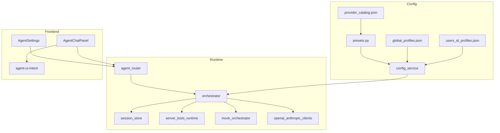

# Agent 底层功能配置与接入升级方案

> 状态：**方案已落盘，实现未开工**  
> 日期：2026-08-29  
> 公开现状说明：[Docs/07-工程保障/agent-profiles.md](../../Docs/07-工程保障/agent-profiles.md)  
> 审查真源：[Docs/06-代码审查/code-review-2026-08-29-agent-subsystem.md](../../Docs/06-代码审查/code-review-2026-08-29-agent-subsystem.md)  
> 切片 A 进度：[.ai/progress/2026-08-29-agent-catalog-isolation.md](../progress/2026-08-29-agent-catalog-isolation.md)

---

## 1. 背景与目标

CGDA 地图助手已完成 **能力切片 A**：多配置档（全局 admin / 个人）、Provider 预设 JSON、演示与真 LLM（OpenAI / Anthropic 兼容）、短会话记忆、只读 `search_layers`、一层 tool follow-up、UI intents、`steps` / `usage`。

本方案规划下一阶段的 **底层功能配置与接入升级**，在不破坏切片 A 演示路径的前提下：

1. **配置与接入加固**（Phase 0）：外呼边界、会话治理、SSRF/注入纵深、错误码语义、kits 缓存  
2. **能力切片 B**：可控写操作接入（`run_workflow` + 确认卡）  
3. **能力切片 C**：有界多跳工具循环 + 扩展只读服务端工具  
4. **能力切片 D**：流式回复 / 思维链（SSE）

原则（见 [Code/agentKits/README.md](../../Code/agentKits/README.md)）：

- 危险写操作必须经用户确认卡  
- 密钥不进 kits 目录  
- HTTP JSON 字段 `snake_case`  
- 演示（`demo`）路径保持无外网可用  

---

## 2. 现状（切片 A）与非目标

### 2.1 已交付

| 能力 | 落点 |
|------|------|
| Provider 预设 JSON + mtime 热载 | `Code/agentKits/presets/provider_catalog.json`、`app/services/agent/presets.py` |
| 全局 / 个人配置档 + 加密密钥 | `app/services/agent/config_service.py`；`{DATA_ROOT}/_runtime/agent/` |
| 协议 `demo` / `openai` / `anthropic` | `orchestrator.py` + `clients/` |
| 短会话记忆、catalog/tools 注入、`steps`/`usage` | `session_store.py`、`AgentChatPanel.vue` |
| 服务端只读 `search_layers`；UI intents 前端执行 | `server_tools_runtime.py`、`agent-ui-intent.ts` |
| Chat IP 限流 | `BACKEND_AGENT_CHAT_RATE_LIMIT_PER_MINUTE`（默认 30） |
| Mock 遗留只 seed 干净 demo；加载期 normalize | `config_service.py`（2026-08-29 `0175931`） |

### 2.2 明确非目标（本升级不做）

- **MCP** 服务端接入或 Agent 作 MCP host  
- 微信小程序侧 Agent（仅设计预留，见 weixin 计划）  
- 用 Agent **替换** `workflow-runs` 主链或 Celery 编排  
- 无界 / 无限 tool loop  
- 把演示预设从 catalog 中删除（演示为默认兜底；真 LLM 仍由用户从预设新建）

### 2.3 切片 A 明确延期项（本方案吸收）

- `run_workflow` 真执行  
- 多跳 tool loop  
- 流式思维链  

---

## 3. 架构关系



数据流简述：

1. 设置页读写配置档 → `/agent/config*`  
2. 聊天 → `/agent/chat`：解析有效 Profile → 注入记忆 / 图层上下文 / 工具 schema → demo 或 LLM → 可选一层 tool → `ui_intents` + `steps` + `usage`  
3. 前端执行 UI intents；服务端仅执行 allowlist 内只读工具  

---

## 4. 阶段与任务拆分

建议顺序：**P0 → B → C → D**（D 的契约可与 C 并行设计，实现建议在 C 稳定后）。


### Phase 0 — 配置与接入加固（优先，约 1 迭代）

| ID | 任务 | 主改文件 | 验收 | 审查对照 |
|----|------|----------|------|----------|
| P0-1 | `/agent/models/refresh` 限流；`scope=global` 仅 admin | `agent_router.py`、`rate_limit.py` | 标准用户调 global → 403；压测出现 429 | M-1 |
| P0-2 | 会话 TTL + 每用户数量上限 + 可选 Beat 清理 | `session_store.py`；可选 beat 钩 | 超限拒绝或轮换；旧文件可清 | M-2 |
| P0-3 | LLM 异常分层；错误码按语义拆分 | `orchestrator.py`、`agent_router.py` | 422/404/502 不再一律 `AUTH_ERROR` | M-3、W-6 |
| P0-4 | 非 demo 协议变更时强制重校验 `base_url` | `config_service.py` | demo→openai 带非法/私网 URL 被拒 | W-2 |
| P0-5 | prompts/tools JSON mtime 缓存（对齐 presets） | `orchestrator.py` | chat 热路径不再每轮多次读盘 | W-3 |
| P0-6 | `client_context` 体积/键白名单；UI intent 前校验可访问 catalog | `orchestrator.py`、`agent-ui-intent.ts` | 超限截断；未知 catalog 不 `addLayer` | W-4、W-5 |
| P0-7 | 同步 kits README（`search_layers` 已实装）+ `agent-profiles` 安全说明 | `Code/agentKits/README.md`、Docs | 文档与代码一致 | — |
| P0-8 | 排查 `test_agent_chat` 与 data_io 同进程顺序污染 | `Test/backend/conftest.py` / agent 夹具 | 组合跑不红 | 审查第八节附带 |

**Phase 0 验证命令（实现阶段）**

```text
Env\Python312\python.exe -m pytest Test/backend/test_agent_chat.py -q
cd Code/frontend && npm run test -- agent-api agent-ui-intent
```

**Phase 0 风险**

- 收紧 `models/refresh` 可能影响标准用户「刷新个人档模型列表」——仅限制 global scope，个人档仍可用。  
- 会话 TTL 过短会丢上下文——默认建议 ≥ 24h，每用户 session 上限建议 20～50。

### Phase B — 工作流接入 + 确认卡（约 1～2 迭代）

| ID | 任务 | 说明 |
|----|------|------|
| B-1 | 契约：`run_workflow` 参数 schema 固化；响应含 `needs_confirmation` / `confirmation_id` | `Code/agentKits/tools/server_tools.json`；必要时 `Code/shared/contracts` |
| B-2 | 后端：短时确认票据（优先 Redis，失败可落 `_runtime/agent/confirmations/`）；真正 enqueue / workflow-runs **仅确认后** | 新 `agent_confirm.py` + `server_tools_runtime.py` |
| B-3 | API：`POST /agent/confirm`（推荐独立端点，避免与自然语言二次确认歧义） | `agent_router.py` |
| B-4 | FE：确认卡（工作流名 / 参数摘要 / 过期倒计时）；同意后调确认 API | `AgentChatPanel` 旁新组件 |
| B-5 | RBAC：`demo` 只读；`standard`/`admin` 可确认；写审计日志（user_id、workflow、confirmation_id） | |
| B-6 | 测试：未确认拒绝、过期票据、越权、确认后任务可见 | 扩展 `test_agent_chat.py` |

**Phase B 依赖**：P0-3（错误码）、切片 A 的 workflow-runs 主链稳定。  
**Phase B 风险**：确认票据与工作流入参必须防篡改（服务端持有快照，客户端只回传 id）。

### Phase C — 多跳工具 + 只读工具面扩展（约 1～2 迭代）

| ID | 任务 | 说明 |
|----|------|------|
| C-1 | 有界多跳（默认 max **4**，可配置 env）；每跳记入 `steps` | `orchestrator.py` |
| C-2 | 新增只读工具：`list_workflows`、`get_layer_meta`（ACL）；可选天气/点查摘要（若契约清晰） | kits + `server_tools_runtime.py` |
| C-3 | 工具 allowlist 分轨：只读自由执行 / 写操作必须走确认 | |
| C-4 | 回归：demo 无外网；LLM 路径用 mock client 测多跳 | |

**Phase C 依赖**：B 的确认分轨模型（即使 B 只做了 `run_workflow`，allowlist 分轨应在 C 复用）。  
**默认多跳上限**：4（开放问题见 §7，实现前可调）。

### Phase D — 流式（约 1 迭代）

| ID | 任务 | 说明 |
|----|------|------|
| D-1 | `POST /agent/chat/stream` **SSE**（优先）；核对 Gateway / nginx 读超时 | `Code/infra/gateway/` |
| D-2 | 事件：`token` / `step` / `intent` / `done` / `error`；入 OpenAPI | 契约 + `npm run check:openapi` |
| D-3 | FE：流式气泡 + steps 渐进；失败回退非流式 `/agent/chat` | `AgentChatPanel.vue` |
| D-4 | demo 可选伪流式（分片规则回复）便于无 key 联调 | `mock_orchestrator.py` |

**Phase D 依赖**：P0 错误模型稳定；建议 C-1 多跳 `steps` 形状先定稿。  
**非目标**：首版不做双向 WebSocket Agent 通道。

---

## 5. 与代码审查项对照

| 审查 ID | 摘要 | 本方案落点 | 备注 |
|---------|------|------------|------|
| C-1 | 导入任务属主 ContextVar | **不进本升级** | 2026-08-29 已修复 |
| M-1 | models/refresh 无限流 + 非 admin 驱动 global | **P0-1** | |
| M-2 | 会话无 TTL / 无数量上限 | **P0-2** | |
| M-3 | 宽异常一律 502「模型失败」 | **P0-3** | |
| W-2 | demo 写 URL 再改协议绕过 SSRF 校验 | **P0-4** | |
| W-3 | tools/prompts 每请求读盘 | **P0-5** | |
| W-4 | UI intent catalog 未校验可访问性 | **P0-6** | |
| W-5 | client_context 直注 prompt | **P0-6** | |
| W-6 | 错误码复用 AUTH_ERROR | **P0-3** | |
| W-1 / W-7 | jobs docstring / SVG logo | **不进本升级** | 非 Agent 主链 |
| 附带 | test_agent_chat 顺序污染 | **P0-8** | |

---

## 6. 里程碑建议

| 里程碑 | 内容 | 建议出口标准 |
|--------|------|--------------|
| M0 | 本文档落盘 | 本文件 + Docs 指针 + progress 条 |
| M1 | Phase 0 合并 | agent 审查 M/W 相关项关闭或有明确 wontfix；相关单测绿 |
| M2 | Phase B 合并 | 确认后可启动真实 workflow-run；demo 无法确认写操作 |
| M3 | Phase C 合并 | 多跳 ≤ 配置上限；新增只读工具有 ACL 测试 |
| M4 | Phase D 合并 | SSE 在 Gateway 联调通过；失败自动回退非流式 |

实现时按 Phase 单开 PR，避免与无关前端微调混提。

---

## 7. 开放问题（实现前拍板）

1. **确认卡协议**：独立 `POST /agent/confirm`（本文推荐）vs chat 内二次自然语言「确认」。默认独立 API。  
2. **多跳默认上限**：本文默认 **4**；是否暴露到部署配置 / Agent 设置 UI。  
3. **流式是否进初代机构交付**：可仅内部联调开启；生产默认非流式直至 Gateway 超时矩阵验证完毕。  
4. **确认票据存储**：Redis（与现网限流同栈，推荐）vs 仅文件；无 Redis 的纯静态演示环境如何降级。  

---

## 8. 文档维护

| 文件 | 职责 |
|------|------|
| 本文件（`.ai/plans/`） | 升级方案 + 任务拆分（AI 工作区，可不上传 GitHub） |
| `Docs/07-工程保障/agent-profiles.md` | 切片 A **现状** + 「后续升级」指针 |
| `.ai/progress/2026-08-29-agent-capability-upgrade.md` | 方案落盘 / 各 Phase 开工状态 |
| `Code/agentKits/README.md` | 契约原则；P0-7 时更新「首版仅 schema」过时表述 |

---

## 9. 实现开工检查清单（勿在方案阶段执行）

- [ ] 选定 Phase（通常先 P0）并开分支  
- [ ] 对照 §5 关闭或标注审查项  
- [ ] 「改 X 则跑 Y」：`Test/backend/test_agent_chat.py`；FE `agent-api` / `agent-ui-intent`；必要时 `check:openapi`  
- [ ] Windows 提交：`git add -A` 后剔除 `Test/.pytest-*` 再 commit  
