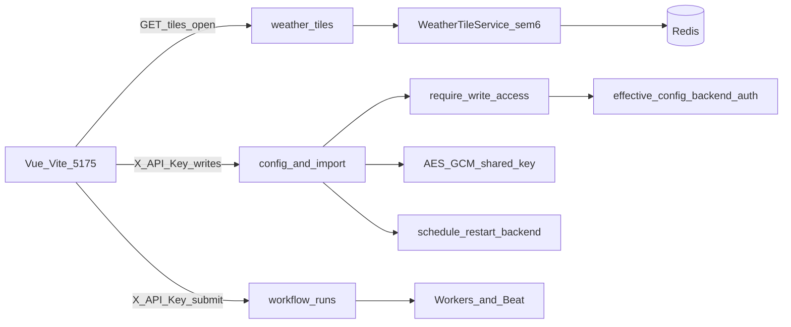

# CGDA 全栈主链代码审查报告（2026-08）

> **范围**：后端鉴权/配置/加密/restart、workflow-runs、天气瓦片；前端图层/瓦片/设置/写鉴权；契约与门禁。  
> **排除**：算法数值正确性、`Tools/` 一次性脚本、Nginx gateway 交付剖面。  
> **方法**：源码深读 + 测试对照；已执行 **B1 + B2 核心**（[fix-review-b1-b2-2026-08.md](./fix-review-b1-b2-2026-08.md)）与 **B2/B3 第二轮**（[fix-review-b2b3-round2-2026-08.md](./fix-review-b2b3-round2-2026-08.md)）。  
> **基线分支**：`dev` @ `fe75db1` 附近；修复落地日 2026-08-08。

---

## 1. Executive summary

近期交付已显著加固 fail-secure 默认（`BACKEND_ENV` 默认 `production`、吊销语义、OpenAPI security scheme、写限流、移除 FE 构建期 API Key）。剩余风险主要集中在：

1. **开发旁路与误配**：`api_keys_enabled=false` + `environment=development` 时写接口全开（有意设计，但共享机/错标 env 危险）。
2. **共享加密主密钥 + 启动不校验 hex 形态**：GEE / API keys / 天气 provider / 远程存储 / 门户凭据共用一把 key；非法 hex 在首次加解密才暴露。
3. **UI restart 返回的 `components` 与真实动作不一致**：始终执行 `launch.py restart backend`。
4. **workflow 事件轮询 IP 解析未尊重 `trust_proxy`**：可伪造 XFF 逃避/分片限流。
5. **写限流不覆盖 `/workflow-runs`**：鉴权后仍可被滥用占容量池。
6. **天气瓦片无鉴权 + 无 HTTP 层 per-IP 限流**（有进程内并发槽，仍可成本放大）。
7. **未鉴权的 `/config` GET** 暴露脱敏密钥列表、数据路径、门户元数据（侦察面）。
8. **OpenAPI drift 仅比 path+method**；`/config` FE 仍大量手写 DTO。
9. **写 API Key 存 localStorage**：XSS ⇒ 写能力失窃。
10. **FE 热路径 ungated `console.log`** + 超大 store（layers ~2.7k / weather-tile ~1.9k LOC）。

---

## 2. Findings

### P0 — 安全 / 生产误配 / 运维诚实性

| ID | 标题 | 证据 | 影响 | 建议 |
|----|------|------|------|------|
| P0-1 | Development 写鉴权旁路 | [`deps.py`](Code/backend/app/api/deps.py) L32–39：`api_keys_enabled=False` 且 `environment=="development"` 时直接 `return`，仅打 warning | 联调故意放行；若共享主机或 `BACKEND_ENV` 误标为 development，任意客户端可写 `/config`、`/import`、`/workflow-runs` | 交付清单强制核对；可选：旁路仅当 `127.0.0.1` 或显式 `BACKEND_DEV_AUTH_BYPASS=1`；补矩阵测试 |
| P0-2 | 加密 key 启动不校验格式/长度 | [`effective_config.py`](Code/backend/app/services/effective_config.py) `assert_encryption_policy` L54–70：有非空 key 即通过；[`gee_credentials_repository.py`](Code/backend/app/services/gee_credentials_repository.py) L100 `bytes.fromhex` 在加解密时才失败 | 错配 key 进程可启动，首次写凭据或读库时才炸；运维难排查 | 启动时校验 64-char hex（32-byte）并 fail-fast；补单测 |
| P0-3 | 多类密钥共用一把 master key | `BACKEND_GEE_CREDENTIALS_ENCRYPTION_KEY` 用于 GEE SA、API keys、weather providers、remote storage、portal（repositories 均 `fromhex` 同一 settings 字段） | 泄露一次 = 全库机密可读 | 文档标明 blast radius；中长期拆 key 或 HKDF 派生；轮换流程写进交付清单 |
| P0-4 | UI restart 忽略已规范化的 `components` | [`service_restart.py`](Code/backend/app/services/service_restart.py) L72–85：校验/排序 `planned` 后固定 `restart backend`；响应却回传 `components: planned`（L108–112） | 操作员以为只重启子集，实际总是 FastAPI+全部 Worker+Beat；误导运维 | 要么按 component 真正重启，要么 API 固定声明 always-full 并忽略入参（契约诚实） |
| P0-5 | Dev 明文回退路径仍存在 | 各 `*_repository._encrypt`：无 key / 无 cryptography / 加密异常时，`secrets_encryption_required()==False` 则存 plaintext + 空 IV；`_decrypt` 空 IV 当明文（如 gee L126–128） | 生产有 `assert_encryption_policy` 护栏；dev DB 若被拷到 prod 且 key 错配，解密语义危险 | 明文行打 schema 标记；生产拒绝读空 IV；补 encryption round-trip / refuse-plaintext 测试 |

**已做对的（不列为缺陷，供对照）**

- 默认 `BACKEND_ENV=production`（[`config.py`](Code/backend/app/core/config.py) L50–53），生产空 auth key → 503 fail-closed（`deps.py` L44–53）。
- `backend_auth` DB 吊销不回落 env（[`effective_config.py`](Code/backend/app/services/effective_config.py) L219–237）。
- 数据根写路径校验绝对路径+存在+可列举（[`config_service.py`](Code/backend/app/services/config_service.py) L775–828）；production 空 `BACKEND_DATA_ROOT` 拒启（`assert_data_root_policy`）。
- 写限流默认尊重 `trust_proxy`（[`rate_limit.py`](Code/backend/app/api/rate_limit.py) L55–70）。

---

### P1 — 可靠性 / 滥用面 / 契约漂移

| ID | 标题 | 证据 | 影响 | 建议 |
|----|------|------|------|------|
| P1-1 | Workflow events 限流 IP 无条件信 XFF | [`workflow_router.py`](Code/backend/app/api/routers/workflow_router.py) `_get_client_ip` L59–66：始终读 `x-forwarded-for` / `x-real-ip`，**未**调用 `rate_limit.client_ip` | 客户端可伪造 IP，逃避或占满他人桶；与写限流策略不一致 | 复用 `rate_limit.client_ip`；补伪造 XFF 测试 |
| P1-2 | 写限流不含 `/workflow-runs` | [`rate_limit.py`](Code/backend/app/api/rate_limit.py) L50–51：仅 `/config`、`/import`；[`main.py`](Code/backend/app/main.py) L147–167 middleware | 持有写 Key（或 dev 旁路）时可高频提交，压垮 Celery 容量池 | 将 POST `/workflow-runs`（及 cancel/retry）纳入写限流或独立提交限流 |
| P1-3 | 天气瓦片公开 + Cache-Control public | [`weather_tile_routes.py`](Code/backend/app/api/weather_tile_routes.py) L54–67 无 auth；L106 `Cache-Control: public`；并发槽约 6（[`tile_service.py`](Code/backend/app/weatherengine/tile_service.py) L43–44） | MapLibre 需要公开读；未鉴权可放大上游/CPU 成本 | 保持无 auth，加 per-IP HTTP 限流或边缘保护；监控 429/503 |
| P1-4 | 未鉴权 `/config` GET 侦察面 | 例：`GET /config/api-keys`（[`config_routes.py`](Code/backend/app/api/config_routes.py) L92–95）、`/data-source` L559、`/portal-credentials` L628 | 脱敏仍泄露 key 名、路径、门户是否已配置 | 生产对敏感 GET 要求读密钥或绑定本机；至少审计哪些 GET 可公开 |
| P1-5 | `demo://` URI 静默填充 | [`download_orchestrator.py`](Code/backend/app/services/download_orchestrator.py) L399–400：缺真实 snapshot URI 时填 `demo://snapshots/...`；实际抓取仍受 [`source_fetcher.py`](Code/backend/app/services/source_fetcher.py) L384+ 与 `BACKEND_DEMO_SOURCES_ENABLED` 门禁 | production 默认 fail（好）；URI 污染仍可能混淆排障 | 缺真实 URI 时显式 `missing`/`error` 状态，勿写 demo scheme |
| P1-6 | GEE API 账号管理默认开启 | [`config.py`](Code/backend/app/core/config.py) L320–324：`gee_api_account_management_enabled` 默认 `true`；注释建议生产 false | 持写 Key 即可经 API 注入 SA（虽加密落库） | 生产默认 false 或交付清单强制关闭 |
| P1-7 | OpenAPI drift 仅 path+method | [`check_openapi_drift.py`](Code/backend/app/services/../scripts/check_openapi_drift.py) `_diff_paths` L100–124 | schema/字段/必填变更可静默漂移至运行时 | 对 critical path 加深 requestBody/参数名哈希比对，或强制 regenerate CI |
| P1-8 | `/config` FE 手写 DTO + runtime 手写残留 | [`settings-api.ts`](Code/frontend/src/services/settings-api.ts) 文件头自承「后续应改走 gen:types」；~33 interfaces；[`runtime-api.ts`](Code/frontend/src/services/runtime-api.ts) 仍有 WeatherCoverage / NodeCache* 等手写；生成的 `api-contracts.ts` ~10k LOC，`api-reexports.ts` 仅 ~74 LOC | `/config/*` 与新 cleanup API 最高漂移风险 | settings/runtime 迁 re-export；扩大 gen:types 消费面 |
| P1-9 | `check:openapi` / `check:catalog` 用裸 `python` | [`package.json`](Code/frontend/package.json) L17–18 | Windows 上可能打到系统 Python，误报/依赖不一致 | 文档要求 `Env/Python312`；脚本改为可覆盖的 `PYTHON` 或仓库相对路径 |
| P1-10 | FE 写 Key 存 localStorage | [`settings-local.ts`](Code/frontend/src/services/settings-local.ts) L47–68；[`backend-auth.ts`](Code/frontend/src/services/backend-auth.ts)（已移除 VITE 内联，正确） | 任意 XSS ⇒ 完整写能力；持久化跨会话 | 短期强化 CSP/依赖审计；中期 sessionStorage+短时或 OS keychain 类方案；补 settings 安全向单测 |

---

### P2 — 债务 / 可观测性 / 可维护性

| ID | 标题 | 证据 | 影响 | 建议 |
|----|------|------|------|------|
| P2-1 | 热路径 ungated `debugLog` → `console.log` | [`weather-tile-manager.ts`](Code/frontend/src/stores/weather-tile-manager.ts) L290–292；[`layers/index.ts`](Code/frontend/src/stores/layers/index.ts) L101–103；[`workflow-runner.ts`](Code/frontend/src/stores/layers/workflow-runner.ts) L41+；对比已门控的 `perf-probe` | 生产控制台噪声、轻微性能、可能泄露运行细节 | 统一走 `perf-probe` 或 `?debug=1` 门控 |
| P2-2 | God-store / 超大模块残留 | `stores/layers/index.ts` ~2667 LOC；`weather-tile-manager.ts` ~1856；`WorkflowCanvas.vue` ~1747；[`MapCanvas.vue`](Code/frontend/src/components/MapCanvas.vue) ~1386（X1/D2 已拆 catalog/poller/runner，主文件仍大） | 评审/回归成本高，竞态难测 | 续拆 overlay sync、viewport、persist 边界 |
| P2-3 | Demo* 契约残留 | [`api_contracts.py`](Code/shared/contracts/api_contracts.py) `DemoLayerSnapshot` 等（约 L117–163） | FE 已无 `demo://` 消费痕迹；协议面膨胀 | 确认无 BE 路由依赖后删除或迁兼容模块 |
| P2-4 | 非关键路径吞异常 | 例 [`persistence_service.py`](Code/backend/app/services/workflow/persistence_service.py) L172–178 `except Exception: pass` | 配置读取失败静默回落默认，排障困难 | 至少 `logger.debug`/`warning` |
| P2-5 | `launch flush` 运维面 | `launch/commands.py`：Redis `FLUSHDB` + 天气文件缓存；硬编码容器名 `cgda-redis`；`--yes` 可跳确认 | CLI-only（好）；共享机误跑清空队列/限流状态 | 文档强调；可选二次确认词；测试绑定容器名 |
| P2-6 | Settings FE 测试几乎空白 | `Test/frontend` ~104 测例；settings 仅 `about-settings-render.test.ts` | 高危写路径无 FE 回归 | 为 ApiKey/DataSource/restart 门禁补组件或 service 测 |
| P2-7 | Stub 节点双门禁需交付核对 | BE `BACKEND_NODE_STUBS_VISIBLE`；FE 默认藏 `executable===false` | 误开生产可见未实现节点 | 交付清单已有条目则保持；加集成断言 |

---

## 3. 测试与门禁缺口

| 域 | 已有覆盖 | 缺口 |
|----|----------|------|
| 鉴权 | `test_config_security.py`（mutating 路由挂了 `require_write_access`）；import/remote 同类 | **无** behavioral 矩阵：dev bypass / 401 / 503 / production+空 key |
| 加密 | 桥接测 `test_gee_bridge_service.py`；部分测试故意 `encryption_key=""` | **无** AES-GCM round-trip、production refuse-plaintext、非法 hex fail-fast |
| Restart / data-root | `test_data_source_paths.py`、`test_data_root_policy.py` | **无** HTTP 测：`ui_restart_enabled=False` → 403；components 诚实性 |
| Workflow | routes/cancel/reuse/compiler/timer 等较强 | XFF vs `trust_proxy`；submit 写限流 |
| Weather tile | `test_weather_tile_service.py`（bbox/cache/semaphore） | 路由层滥用/限流；422 vs 503 契约 HTTP 测偏少 |
| OpenAPI | path+method drift + `gen:types` | schema 深度；settings 手写与生成一致性 |
| FE settings | 几乎无 | 写 Key 附着、restart confirm、paths 校验 UX |
| launch flush | 无自动化 | 可选 smoke（mock docker） |

**门禁健康度**

- 健康：critical 前缀覆盖面已扩到 `/config` `/workflow-*` `/import` `/gee` 等；catalog 有独立 `check:catalog`。
- 风险：depth=浅；Windows 裸 `python`；生成类型消费不足 → 门禁「绿」≠ 类型安全。

---

## 4. 修复批次（确认后另开执行轮）

### B1 — P0 加固（安全 / 运维诚实）

| 项 | 动作 | 验证 |
|----|------|------|
| P0-1 | 文档化鉴权矩阵；可选收紧 bypass（本机或显式 flag）；补 pytest 矩阵 | `Env/Python312/python.exe -m pytest Test/backend/test_config_security.py -q`（扩展用例） |
| P0-2 | `assert_encryption_policy` 校验 64 hex；非法则拒启 | 新测 + 现有 data-root/encryption 启动测 |
| P0-3 | 交付清单写明 blast radius；评估 HKDF 派生（可先文档） | 清单评审 |
| P0-4 | Restart API：按 component 实现 **或** 契约改为 always `["fastapi","worker","beat"]` 并忽略入参 | `test_data_source_paths.py` + 新 restart 契约测 |
| P0-5 | 明文行标记；生产拒绝空 IV 解密；round-trip 测 | 新 `test_secrets_encryption.py` |

### B2 — P1 滥用面与契约

| 项 | 动作 | 验证 |
|----|------|------|
| P1-1 | events IP → `rate_limit.client_ip` | workflow 路由测 + 伪造头 |
| P1-2 | `/workflow-runs` 写方法纳入限流（或独立桶） | rate_limit / workflow 测 |
| P1-3 | 瓦片 per-IP 限流（宽松） | weather tile 路由测 |
| P1-4 | 敏感 config GET 策略（auth 或 loopback） | `test_config_security.py` 扩展 |
| P1-5 | 去掉静默 `demo://` URI 填充 | `test_source_fetcher_demo_compat.py` 等 |
| P1-6 | 生产默认关闭 GEE API account management（或清单强制） | config 默认值测 |
| P1-7/8/9 | 加深 drift 或 settings 迁 gen:types；check 脚本用 Env Python | `npm run check:openapi` + `gen:types` |
| P1-10 | settings 测 + CSP/存储策略说明 | FE vitest settings 子集 |

### B3 — P2 债务

| 项 | 动作 | 验证 |
|----|------|------|
| P2-1 | debugLog 门控 | `npm run lint` + 相关 vitest |
| P2-2 | 续拆 layers / weather-tile / WorkflowCanvas | 既有 FE 测全绿 |
| P2-3 | Demo 死契约清理 | OpenAPI + pytest 契约 |
| P2-4 | 吞异常打日志 | 抽测 |
| P2-5/6/7 | flush 文档/确认；settings FE 测；stub 交付断言 | 文档 + vitest |

**建议执行顺序**：B1 → B2 → B3；每批单独 PR；勿与功能开发混提。

---

## 5. 架构快照（审查时）

---

## 6. 完成标准核对

- [x] P0/P1 均有路径级证据  
- [x] 分批修复计划可独立开执行（B1/B2/B3 + 验证命令）  
- [x] 本阶段仅本报告落盘于 `.ai/progress/`，无业务代码改动  

**下一步**：用户确认后按 B1 开修复执行轮。
