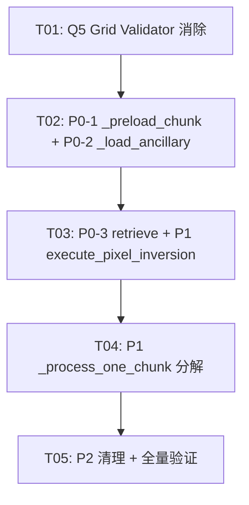

# omega_sf.py 复杂度重构 · 架构设计 + 任务分解

> **状态**：DRAFT  
> **日期**：2025-08-10  
> **作者**：高见远（Gao）· 架构师  
> **前置文档**：`Docs/PRD_增量_异常捕获收窄.md`（产品经理·许清楚）  
> **约束声明**：所有设计决策遵循主理人 5 项拍板（Q1-Q5），不可妥协。

---

## 目录

1. [当前状态诊断](#1-当前状态诊断)
2. [重构方案](#2-重构方案)
   - [Q5: `_make_grid_validator` 消除方案](#q5-_make_grid_validator-消除方案)
   - [P0-1: `_preload_chunk` 提取方案](#p0-1-_preload_chunk-提取方案)
   - [P0-2: `_load_ancillary` 提取方案](#p0-2-_load_ancillary-提取方案)
   - [P0-3: `retrieve_omega_sf_daily` 提取方案](#p0-3-retrieve_omega_sf_daily-提取方案)
   - [P1: `execute_pixel_inversion` Step 提取方案](#p1-execute_pixel_inversion-step-提取方案)
   - [P1: `_process_one_chunk` 分解方案](#p1-_process_one_chunk-分解方案)
3. [文件列表](#3-文件列表)
4. [任务分解](#4-任务分解)
5. [共享知识](#5-共享知识)
6. [待明确事项](#6-待明确事项)

---

## 1. 当前状态诊断

### 1.1 radon cc 实测结果

```
$ radon cc omega_sf.py -s --total-average

F 556:0 execute_pixel_inversion      D (28)
F 2904:0 _compute_fy3b_bias_cached   D (28)
F 2523:0 _build_time_series           D (23)
F 2249:0 retrieve_omega_sf_daily      D (21)
F 1900:0 _process_one_chunk           C (18)
F 1531:0 _invert_omega_sf_pixel_indices C (14)
F 3207:0 _compute_sf_inverted_day     C (14)
F 3287:0 _preload_chunk               B (8)   ← PRD 标注 C57（已提取 5 个 helper 后降至 B8）
F 2790:0 _load_ancillary              B (9)   ← PRD 标注 C52（已提取 4 个 helper 后降至 B9）

60 blocks analyzed. Average complexity: B (7.2)
```

### 1.2 PRD 标注 vs 实测差异

| 函数 | PRD 标注 | radon 实测 | 说明 |
|------|---------|-----------|------|
| `_preload_chunk` | C57 | **B (8)** | 5 个 helper 已提取，剩余复杂度已很低 |
| `_load_ancillary` | C52 | **B (9)** | 4 个 helper 已提取 |
| `retrieve_omega_sf_daily` | C41 | **D (21)** | 尚未提取 helper |
| `execute_pixel_inversion` | ~339 行 | **D (28)** | 尚未提取 Step 0/1/3 |
| `_process_one_chunk` | - | **C (18)** | P1 目标 |

### 1.3 重构后目标

| 函数 | 当前 | 目标 |
|------|------|------|
| `_preload_chunk` | B (8) | ≤ A (5) |
| `_load_ancillary` | B (9) | ≤ A (5) |
| `retrieve_omega_sf_daily` | D (21) | ≤ C (12) |
| `execute_pixel_inversion` | D (28) | ≤ C (15) |
| `_process_one_chunk` | C (18) | ≤ B (10) |

---

## 2. 重构方案

### 架构总览

```
retrieve_omega_sf_daily          ← P0-3: 提取 _load_fixed_omega_map / _finalize_and_save
├── _build_time_series
├── _load_ancillary              ← P0-2: 提取 _load_anc_scalar_fields
├── make_viirs8_blocks
├── _load_fixed_omega_map        ← NEW: 加载固定 OMEGA map
├── _prepare_chunks
├── _process_one_chunk           ← P1: 提取 _build_chunk_validity_mask
│   ├── _preload_chunk           ← P0-1: 提取 _preload_one_day; Q5: 消除 _make_grid_validator
│   │   └── _preload_one_day     ← NEW: 单日数据加载
│   ├── _build_chunk_validity_mask ← NEW: chunk 有效性掩码
│   └── _run_pixel_inversion
│       └── execute_pixel_inversion  ← P1: 提取 Step 0/1/3
│           ├── _step0_compute_tau_star     ← NEW
│           ├── _step1_invert_halpha        ← NEW
│           ├── [Step 2 闭包保持原位 ← Q2]
│           └── _step3_ddca_retrieval       ← NEW
├── _assemble_block_grids
├── _finalize_and_save           ← NEW: 汇总 + 保存
└── OmegaSfResult
```

### Q5: `_make_grid_validator` 消除方案

**当前状态**：
- `_make_grid_validator` (L3031–3055)：闭包工厂，创建带 mutable dict state 的 `_validate` 闭包
- `_preload_chunk` L3320：`validate_grid = _make_grid_validator(npix, nrows, ncols)`
- `_load_smap_day` L3072–3076：内部调用 `validate_grid(vals, "SMAP", date_str)`
- `_load_smap_day` 签名：`(smap_folder, date_str, validate_grid) → dict`

**消除方案**：

1. **删除** `_make_grid_validator` 函数（L3031–3055）
2. **修改** `_load_smap_day` 签名：移除 `validate_grid` 参数
   ```python
   # 旧签名
   def _load_smap_day(smap_folder: str, date_str: str, validate_grid) -> dict[str, Any]:
   # 新签名
   def _load_smap_day(smap_folder: str, date_str: str) -> dict[str, Any]:
   ```
3. **在 `_preload_chunk` 主循环前显式校验**（首次 SMAP 文件加载后）：
   ```python
   # 在 _preload_chunk 中，矩阵初始化之后、主循环之前：
   _grid_validated = False
   for date in tvec:
       date_str = date.strftime("%Y%m%d")
       smap_file = Path(smap_folder) / f"{date_str}.mat"
       if smap_file.exists():
           try:
               from ingest.mat_bundle import load_mat_file
               test_data = load_mat_file(str(smap_file))
               for _k in ("TBv", "TBv_mat", "Ts", "Ts_mat", "sm_dca", "SM"):
                   if _k in test_data:
                       vals = np.asarray(test_data[_k], dtype=np.float64).ravel()
                       if vals.size != npix:
                           logger.warning(
                               "[GRID] SMAP/%s: 数据大小 %d != grid npix %d (nrows=%d ncols=%d)。"
                               "可能存在 MAT v7.3 转置问题或网格定义不匹配。",
                               date_str, vals.size, npix, nrows, ncols,
                           )
                       break
           except Exception:  # noqa: BLE001 — 网格校验容错
               pass
           break  # 仅校验首个存在的 SMAP 文件
   ```

**效果**：
- 消除隐式 mutable state（闭包中的 `{"done": False}` dict）
- 网格校验逻辑显式出现在 `_preload_chunk` 层级
- `_load_smap_day` 职责更纯：仅加载数据，不负责校验
- 异常语义保留（`except Exception: pass` — 网格校验失败不阻塞流程）

### P0-1: `_preload_chunk` 提取方案

**当前结构** (L3287–3397, radon B8)：
```
_preload_chunk(tvec, nrows, ncols, config, smap_folder, fy3d_folder, fy3b_folder,
               ndvi_clim_folder, ndvi_folder, anc, *, lin_pix, chunk_start, chunk_end)
  ├── L3310–3317: 参数解析 (lin_pix vs chunk_start/chunk_end)
  ├── L3320:     网格校验器创建 ← Q5 消除
  ├── L3322–3328: 7 矩阵初始化
  ├── L3330:     sf_static 提取
  ├── L3332–3386: 主循环 (55 行) ← 提取目标
  │   ├── L3337:  SMAP 加载
  │   ├── L3340–3355: FY TB 或 SMAP TB
  │   ├── L3363:  温度
  │   ├── L3367–3372: SM_ref
  │   ├── L3375–3377: NDVI
  │   └── L3380–3386: SF (STATIC or INVERTED_DAILY)
  └── L3388–3396: 返回 dict
```

**提取函数**：`_preload_one_day`

```python
def _preload_one_day(
    date: datetime,
    doy: int,
    lin_pix: np.ndarray,
    *,
    config: OmegaSfConfig,
    smap_folder: str,
    fy3d_folder: str,
    fy3b_folder: str,
    ndvi_clim_folder: str,
    ndvi_folder: str,
    anc: dict[str, np.ndarray],
    sf_static: np.ndarray,
) -> tuple[np.ndarray, np.ndarray, np.ndarray, np.ndarray, np.ndarray, np.ndarray, np.ndarray]:
    """加载单日 chunk 数据。

    从 SMAP/FY/NDVI 文件加载一天的 TBv/TBh/IA/Ts/SM_ref/NDVI/SF，
    返回 7 个形状为 (chunk_pix,) 的 1D 数组。
    缺失数据时对应行保持 NaN（各 helper 内部容错）。

    Args:
        date: 日期
        doy: day of year
        lin_pix: 像元线性索引 (chunk_pix,)
        config: OmegaSfConfig
        smap_folder: SMAP .mat 文件目录
        fy3d_folder: FY-3D .mat 目录
        fy3b_folder: FY-3B .mat 目录
        ndvi_clim_folder: NDVI DOY 气候态目录
        ndvi_folder: NDVI 逐日目录
        anc: 辅助库 dict
        sf_static: 静态 SF 数组 (npix,) ravel

    Returns:
        (tbv_row, tbh_row, ia_row, ts_row, sm_ref_row, ndvi_row, sf_row)
        每个元素为 shape (chunk_pix,) 的 np.ndarray
    """
```

**提取行范围**：L3333–L3386（主循环体，含 `date_str`/`doy` 计算）

**`_preload_chunk` 退化后**：
```python
def _preload_chunk(...) -> dict[str, np.ndarray]:
    # 1. 参数解析 (L3310–3317, 保持不变)
    # 2. 网格校验 (Q5: 显式校验首个 SMAP 文件)
    # 3. 矩阵初始化 (L3322–3328, 保持不变)
    # 4. sf_static 提取 (L3330, 保持不变)
    # 5. 主循环退化：
    for k, date in enumerate(tvec):
        tbv_row, tbh_row, ia_row, ts_row, sm_row, ndvi_row, sf_row = _preload_one_day(
            date, date.timetuple().tm_yday, lin_pix,
            config=config, smap_folder=smap_folder,
            fy3d_folder=fy3d_folder, fy3b_folder=fy3b_folder,
            ndvi_clim_folder=ndvi_clim_folder, ndvi_folder=ndvi_folder,
            anc=anc, sf_static=sf_static,
        )
        tbv_mat[k] = tbv_row
        tbh_mat[k] = tbh_row
        ia_mat[k] = ia_row
        ts_mat[k] = ts_row
        sm_ref_mat[k] = sm_row
        ndvi_mat[k] = ndvi_row
        sf_mat[k] = sf_row
    # 6. 返回 dict (L3388–3396, 保持不变)
```

**复杂度预期**：`_preload_chunk` B(8) → A(4-5)，`_preload_one_day` ≈ B(7)

**Golden 验证**：
- `test_omega_sf_io_contract.py::TestPreloadChunk`（全部 6 个用例）
  - `test_returns_all_seven_keys`
  - `test_output_shapes`
  - `test_smap_tb_values_filled`
  - `test_sf_static_mode`
  - `test_chunk_start_end_equivalent_to_lin_pix`
  - `test_missing_smap_day_leaves_nan`
- `test_omega_retrieval_golden.py`（全量回归）

### P0-2: `_load_ancillary` 提取方案

**当前结构** (L2790–2846, radon B9)：
```
_load_ancillary(anc_root) → dict
  ├── L2800–2809: IGBP + lat/lon 加载
  ├── L2812–2823: 6 标量场循环 (albedo/b/sf_static/bd/h/clay) ← 提取目标
  ├── L2828–2832: NDVI 极值加载
  ├── L2835–2838: NDVI 气候态加载
  ├── L2841:     默认值填充
  └── L2844:     孔隙度计算
```

**提取函数**：`_load_anc_scalar_fields`

```python
def _load_anc_scalar_fields(root: Path) -> dict[str, np.ndarray]:
    """加载辅助库 6 个标量场：albedo/b/sf_static/bd/h/clay。

    每个字段从对应 .mat 文件加载，缺失时跳过（dict 中不含该 key）。
    对应原 ``_load_ancillary`` L2812–2823。

    Args:
        root: 辅助库根目录 Path

    Returns:
        dict，可能包含键: albedo, b, sf_static, bd, h, clay
        仅包含成功加载的字段。
    """
```

**提取行范围**：L2812–L2823（`_FIELDS` 列表定义 + for 循环）

**`_load_ancillary` 退化后**：
```python
def _load_ancillary(anc_root: str) -> dict[str, np.ndarray]:
    root = Path(anc_root)
    anc: dict[str, np.ndarray] = {}

    # IGBP + lat/lon
    lc = _load_anc_mat_field(root, "IGBP_9km_12.mat", (...))
    if lc is not None: anc["landcover"] = lc
    lat, lon = _load_anc_lat_lon(root)
    if lat is not None: anc["lat"] = lat
    if lon is not None: anc["lon"] = lon

    # 6 标量场（委托）
    anc.update(_load_anc_scalar_fields(root))

    # NDVI 极值
    vmax, vmin = _load_anc_ndvi_extrema(root)
    if vmax is not None: anc["ndvi_v_max"] = vmax
    if vmin is not None: anc["ndvi_v_min"] = vmin

    # NDVI 气候态
    ndvi_clim_folder = root / "NDVI_clim"
    if ndvi_clim_folder.exists():
        anc["ndvi_clim_max"] = _build_ndvi_clim_max(ndvi_clim_folder)
        anc["ndvi_clim_min"] = _build_ndvi_clim_min(ndvi_clim_folder)

    # 默认值 + 孔隙度
    _fill_anc_defaults(anc)
    _compute_anc_porosity(anc)

    return anc
```

**复杂度预期**：`_load_ancillary` B(9) → A(4-5)，`_load_anc_scalar_fields` ≈ A(2)

**Golden 验证**：
- `test_omega_sf_io_contract.py::TestLoadAncillary`（全部 6 个用例）
  - `test_loads_all_fields`
  - `test_landcover_values`
  - `test_porosity_computed_from_bd`
  - `test_ndvi_extrema_raveled`
  - `test_missing_igbp_falls_back_to_defaults`
  - `test_ndvi_extrema_unreadable_falls_back_to_clim`
- `test_omega_retrieval_golden.py`（全量回归）

### P0-3: `retrieve_omega_sf_daily` 提取方案

**当前结构** (L2249–2517, radon D21)：
```
retrieve_omega_sf_daily(...) → OmegaSfResult
  ├── Step 1 (L2309–2316): 构建时间序列
  ├── Step 2 (L2318–2325): 加载辅助库
  ├── Step 3 (L2327–2329): 构建块结构
  ├── [插] (L2331–2361): NDVI 气候态 + 诊断
  ├── Step 5 (L2363–2370): 固定 OMEGA map ← 提取: _load_fixed_omega_map
  ├── Step 6 (L2372–2423): 逐 chunk 反演循环
  ├── [插] (L2425–2449): 进度日志
  ├── Step 7a (L2451–2460): 汇总 OMEGA_pft/pixel
  ├── Step 8 (L2462–2504): 保存输出          ← 提取: _finalize_and_save
  └── Step 9 (L2506–2517): 返回 OmegaSfResult
```

**提取函数 1**：`_load_fixed_omega_map`

```python
def _load_fixed_omega_map(config: OmegaSfConfig) -> np.ndarray | None:
    """加载固定 OMEGA map（PFT 模式）。

    从 ``{config.out_aux}/omega_pft_from_exp0.mat`` 读取 omega_pft。
    非 PFT 模式或文件不存在时返回 None。
    对应原 ``retrieve_omega_sf_daily`` L2363–2370。

    Args:
        config: OmegaSfConfig（读取 omega_fixed_mode / out_aux）

    Returns:
        omega_fixed_map (npix,) 或 None
    """
```

**提取行范围**：L2363–L2370

**提取函数 2**：`_finalize_and_save`

```python
def _finalize_and_save(
    state: _ChunkLoopState,
    block_struct: BlockStructure,
    grid_shape: tuple[int, int],
    npix: int,
    chunk_lin_list: list[np.ndarray],
    max_valid_pixels: int,
    output_dir: str,
    progress_callback: Any,
) -> OmegaSfResult:
    """汇总输出 + 保存 + 构建 OmegaSfResult。

    包含：
    - build_omega_pft_from_results / build_omega_pixel_from_results
    - _assemble_block_grids
    - _persist_block_maps (finalize=True)
    - omega_pft.mat / omega_pixel.mat 保存
    对应原 ``retrieve_omega_sf_daily`` L2451–2517。

    Args:
        state: chunk 循环状态（含 all_results / n_processed / n_success / n_failed）
        block_struct: 8 天块结构
        grid_shape: (nrows, ncols)
        npix: 总像元数
        chunk_lin_list: chunk 列表（用于进度）
        max_valid_pixels: 最大有效像元数
        output_dir: 输出目录（空字符串表示不写盘）
        progress_callback: 进度回调

    Returns:
        OmegaSfResult
    """
```

**提取行范围**：L2451–L2517（从 `# 7) 汇总输出` 到函数末尾）

**`retrieve_omega_sf_daily` 退化后（6 步编排器）**：
```python
def retrieve_omega_sf_daily(...) -> OmegaSfResult:
    # 1) 构建时间序列
    tvec = _build_time_series(...)
    # 2) 加载静态辅助库
    anc = _load_ancillary(anc_root)
    # 3) 构建块结构
    block_struct = make_viirs8_blocks(tvec, ...)
    # 4) 加载固定 OMEGA
    omega_fixed_map = _load_fixed_omega_map(config)
    # 5) 逐 chunk 反演
    #    （chunk 准备 + 主循环 + 进度，保持在函数内）
    # 6) 汇总 + 保存
    return _finalize_and_save(state, block_struct, grid_shape, ...)
```

**复杂度预期**：`retrieve_omega_sf_daily` D(21) → C(12-14)，两个新 helper 各 ≈ A(2-3)

**Golden 验证**：
- `test_omega_sf_e2e.py::TestRetrieveOmegaSfDailyE2E`（全部 6 个用例）
  - `test_returns_omega_sf_result`
  - `test_pixel_map_shape_matches_grid`
  - `test_block_maps_shape_matches_blocks`
  - `test_counts_consistent`
  - `test_output_dir_writes_files`
  - `test_max_pixels_limits_processing`
  - `test_numerical_baseline_stable`
- `test_omega_retrieval_golden.py`（全量回归）

### P1: `execute_pixel_inversion` Step 提取方案

**当前结构** (L556–894, radon D28)：
```
execute_pixel_inversion(...) → PixelResult | None
  ├── L601–611:  clay/porosity 有效性
  ├── L613–629:  [Step 0] Tau 计算 ← 提取: _step0_compute_tau_star
  ├── L631–664:  有效性 + 低 τ 选择 (保持在位)
  ├── L666–760:  [Step 1] h/alpha 反演 ← 提取: _step1_invert_halpha
  │   ├── L672–684: _tb_ctx_for_theta 闭包 ← 不用于 Step 1, 留在原位给 Step 3
  │   ├── L686–700: omega_low + 低 τ 数组准备
  │   ├── L701–710: model_ctx 构建 + 初始猜测
  │   ├── L713–730: _resid_halpha 闭包
  │   └── L732–760: least_squares + 结果广播
  ├── L762–848:  [Step 2] OMEGA 块识别 ← Q2: 闭包保持原位
  ├── L850–883:  [Step 3] DDCA 逐日反演 ← 提取: _step3_ddca_retrieval
  └── L885–894:  构建 PixelResult
```

**提取函数 1**：`_step0_compute_tau_star`

```python
def _step0_compute_tau_star(
    ndvi: np.ndarray,
    ia: np.ndarray,
    sf_col: np.ndarray,
    ndvi_max: float,
    ndvi_min: float,
    landcover: int,
    b_param: float,
    nt: int,
) -> np.ndarray:
    """Step 0: 逐日 Tau 计算（矢量化）。

    使用 tau_from_ndvi 计算全时序 Tau。
    对应原 ``execute_pixel_inversion`` L613–629。

    Args:
        ndvi: NDVI 时间序列 (Nt,)
        ia: 入射角时间序列 (Nt,)
        sf_col: SF 时间序列 (Nt,)
        ndvi_max, ndvi_min: NDVI 气候态极值
        landcover: IGBP 类型
        b_param: B 参数
        nt: 时间序列长度

    Returns:
        tau_star (Nt,) — 缺测位置为 NaN
    """
```

**提取行范围**：L613–L629（精确复制，不含有效判断逻辑——有效判断保持在位）

**提取函数 2**：`_step1_invert_halpha`

```python
def _step1_invert_halpha(
    tbv: np.ndarray,
    tbh: np.ndarray,
    ts: np.ndarray,
    tau_star: np.ndarray,
    sm_ref: np.ndarray,
    ia: np.ndarray,
    low_tau: np.ndarray,
    clay_fraction: float,
    freq_ghz: float,
    omega_low: float,
    h_static: float,
    config: OmegaSfConfig,
) -> tuple[float, float, np.ndarray, np.ndarray]:
    """Step 1: h/alpha 联合优化（所有低 τ 样本）。

    使用 scipy least_squares 联合优化 [h, alpha]。
    内部定义 _resid_halpha 闭包调用 _resid_halpha_single_temp。
    对应原 ``execute_pixel_inversion`` L666–760。

    Args:
        tbv, tbh, ts, tau_star, sm_ref, ia: 全时序 (Nt,)
        low_tau: 低 τ 布尔掩码 (Nt,)
        clay_fraction: 黏土含量
        freq_ghz: 频率
        omega_low: 低 τ 模式单次散射反照率
        h_static: 静态 h 值
        config: OmegaSfConfig（读取 bounds_h, bounds_alpha, alpha0, lambda_alpha）

    Returns:
        (h_star, alpha_star, h_star_series, alpha_series)
        h_star/alpha_star: 标量优化结果
        h_star_series/alpha_series: (Nt,) 广播到 valid_tau 样本
    """
```

**关键细节**：
- `_resid_halpha` 闭包（L713–730）在函数内部定义，调用顶层 `_resid_halpha_single_temp`
- `model_ctx_halpha`（L702）在函数内部构建
- 不涉及 `_tb_ctx_for_theta`（该闭包仅 Step 3 使用）
- `omega_low` 已在 `execute_pixel_inversion` 中计算（L688），作为参数传入

**提取行范围**：L666–L760（从 `# Step 1` 注释到 `alpha_series[valid_tau] = alpha_star`）

**提取函数 3**：`_step3_ddca_retrieval`

```python
def _step3_ddca_retrieval(
    tbv: np.ndarray,
    tbh: np.ndarray,
    ts: np.ndarray,
    ia: np.ndarray,
    tau_star: np.ndarray,
    valid_tau: np.ndarray,
    omega_series: np.ndarray,
    h_star_series: np.ndarray,
    alpha_series: np.ndarray,
    h_star: float,
    alpha_star: float,
    clay_fraction: float,
    porosity: float,
    freq_ghz: float,
    config: OmegaSfConfig,
) -> tuple[np.ndarray, np.ndarray]:
    """Step 3: 逐日 SM/VOD DDCA 反演。

    使用 _ddca_single_temp 逐日反演。
    内部重建 _tb_ctx_for_theta 闭包（含 Fresnel 缓存）。
    对应原 ``execute_pixel_inversion`` L850–883。

    Args:
        tbv, tbh, ts, ia, tau_star: 全时序 (Nt,)
        valid_tau: 有效 τ 布尔掩码 (Nt,)
        omega_series: OMEGA 序列 (Nt,)
        h_star_series, alpha_series: h/alpha 序列 (Nt,)
        h_star, alpha_star: 标量回退值
        clay_fraction, porosity: 静态参数
        freq_ghz: 频率
        config: OmegaSfConfig（读取 lambda_tau）

    Returns:
        (sm_ret, vod_ret) — 各 (Nt,)，无效位置 NaN
    """
```

**关键细节**：
- `_tb_ctx_for_theta` 闭包（L676–684）在函数内部重建：
  ```python
  dielectric_ctx = build_tb_model_context(freq_ghz, clay_fraction, 40.0).dielectric
  fresnel_cache: dict[float, object] = {}
  def _tb_ctx_for_theta(theta: float):
      ...
  ```
- `model_ctx_k` 每样本现算（与原始一致）

**提取行范围**：L850–L883（从 `# Step 3` 到 `vod_ret[k] = vod_val`）

**`execute_pixel_inversion` 退化后**：
```python
def execute_pixel_inversion(...) -> PixelResult | None:
    # clay/porosity 有效性 (L601–611, 保持)
    # Step 0 (委托)
    tau_star = _step0_compute_tau_star(ndvi, ia, sf_col, ndvi_max, ndvi_min, landcover, b_param, nt)
    # 有效性 + 低 τ 选择 (L631–664, 保持)
    # Step 1 (委托)
    h_star, alpha_star, h_star_series, alpha_series = _step1_invert_halpha(...)
    # Step 2: OMEGA 块识别 (L762–848, Q2: 闭包保持原位)
    # Step 3 (委托)
    sm_ret, vod_ret = _step3_ddca_retrieval(...)
    # 返回 PixelResult (L885–894, 保持)
```

**复杂度预期**：`execute_pixel_inversion` D(28) → C(14-15)，三个 Step helper 各 ≈ B(6-9)

**Golden 验证**：
- `test_omega_retrieval_golden.py`（全量回归 — 8 pixel + 1 matrix）
  - `test_pixel_cases_match_fixture`
  - `test_matrix_case_matches_fixture`

### P1: `_process_one_chunk` 分解方案

**当前结构** (L1900–2106, radon C18)：
```
_process_one_chunk(...)
  ├── L1935–1941: 取消检查 + 跳过检查
  ├── L1943–1950: 日志
  ├── L1952–1976: 进度 + _preload_chunk
  ├── L1978–2007: 有效性掩码计算 ← 提取: _build_chunk_validity_mask
  ├── L2008–2021: 跳过计数 + 诊断
  ├── L2024:       诊断 emit
  ├── L2026–2033:  测试模式截断
  ├── L2035–2050:  _run_pixel_inversion
  ├── L2052–2056:  状态更新
  ├── L2058–2097:  checkpoint + 进度 + 渐进写盘
  └── L2099–2105:  测试模式限检查
```

**提取函数**：`_build_chunk_validity_mask`

```python
def _build_chunk_validity_mask(
    chunk_data: dict[str, np.ndarray],
    anc: dict[str, np.ndarray],
    lin_pix: np.ndarray,
) -> np.ndarray:
    """构建 chunk 有效像元掩码。

    检查 TBv/TBh/Ts/SM_ref/NDVI 至少有一个有限值 + clay/porosity 有效。
    对应原 ``_process_one_chunk`` L1990–2007。

    Args:
        chunk_data: _preload_chunk 返回的 dict（含 tbv/tbh/ts/sm_ref/ndvi）
        anc: 辅助库 dict（含 clay/porosity）
        lin_pix: 像元线性索引

    Returns:
        valid_mask (chunk_pix,) bool 数组
    """
```

**提取行范围**：L1990–L2007（有效性掩码计算）

**注**：`_process_one_chunk` 的进一步切分（预读/有效性/反演/写盘）在 P0 完成后复杂度可能已降至 B(10) 以下。若 radon 仍显示 C(12+)，可进一步提取 `_chunk_progressive_write`（L2058–2097）。P2 阶段评估。

**Golden 验证**：
- `test_omega_sf_e2e.py::TestRetrieveOmegaSfDailyE2E`（全量）
- `test_omega_retrieval_golden.py`（全量回归）

---

## 3. 文件列表

### 修改的文件

| 文件 | 变更类型 | 说明 |
|------|---------|------|
| `Code/algorithms/providers/Python/algorithms/omega_sf.py` | **修改** | 所有提取/重构操作的目标文件 |

### 不修改的文件（仅验证）

| 文件 | 用途 |
|------|------|
| `Test/algorithms/test_omega_sf_io_contract.py` | P0-1/P0-2 重构后验证 |
| `Test/algorithms/test_omega_sf_e2e.py` | P0-3/P1 重构后验证 |
| `Test/algorithms/test_omega_retrieval_golden.py` | 全阶段数值回归 |

### 不新增文件

Q1 决策：P0/P1 阶段不拆文件。

---

## 4. 任务分解

### T01 — 项目基础设施：Q5 Grid Validator 消除 + `_load_smap_day` 签名清理

| 维度 | 内容 |
|------|------|
| **Task ID** | T01 |
| **优先级** | P0 |
| **涉及函数** | `_make_grid_validator` (L3031–3055) — **删除** |
| | `_load_smap_day` (L3058–3081) — **修改签名** |
| | `_preload_chunk` (L3287–3397) — **添加显式网格校验** |
| **具体操作** | 1. 删除 `_make_grid_validator` 函数（L3031–3055） |
| | 2. 修改 `_load_smap_day` 签名：移除 `validate_grid` 参数 |
| | 3. 在 `_load_smap_day` 内部：删除 `validate_grid(...)` 调用（L3072–3076） |
| | 4. 在 `_preload_chunk` 中：删除 `validate_grid = _make_grid_validator(...)` 行（L3320） |
| | 5. 在 `_preload_chunk` 中：矩阵初始化后、主循环前，添加显式 SMAP 网格大小校验（代码见 §2 Q5 方案） |
| | 6. 搜索全文件确保无其他 `_make_grid_validator` 或 `validate_grid` 引用 |
| **Golden 验证** | `Env/Python312/python.exe -m pytest Test/algorithms/test_omega_sf_io_contract.py -q` |
| | `Env/Python312/python.exe -m pytest Test/algorithms/test_omega_retrieval_golden.py -q` |
| **依赖** | 无 |
| **验收标准** | 1. `_make_grid_validator` 函数已删除 |
| | 2. `_load_smap_day` 不再接收 `validate_grid` 参数 |
| | 3. 网格校验在 `_preload_chunk` 主循环前显式执行 |
| | 4. io_contract 测试全部通过（尤其是 `TestPreloadChunk` 6 个用例） |
| | 5. golden 测试通过（若 golden fixture 不可用，记录并继续——不阻塞） |

**⚠️ 注意**：若本地环境缺少 SMAP 数据文件导致 golden 测试失败，工程师必须：
1. 在 commit message 中标注 `[GOLDEN-SKIP] T01`
2. 在最终 IS_PASS 审查中标注 "golden 跳过的步骤: T01"

---

### T02 — 数据加载层：P0-1 `_preload_chunk` + P0-2 `_load_ancillary`

| 维度 | 内容 |
|------|------|
| **Task ID** | T02 |
| **优先级** | P0 |
| **依赖** | T01 |
| **涉及函数** | `_preload_chunk` (L3287–3397) — 退化 |
| | `_preload_one_day` — **新增** (L3333–3386 提取) |
| | `_load_ancillary` (L2790–2846) — 退化 |
| | `_load_anc_scalar_fields` — **新增** (L2812–2823 提取) |
| **具体操作** | |
| **P0-1 部分** | 1. 从 `_preload_chunk` 主循环体（L3333–3386）提取为 `_preload_one_day` |
| | 2. 函数签名见 §2 P0-1 方案 |
| | 3. `_preload_one_day` 放在 `_preload_chunk` 之前（紧跟 `_compute_sf_inverted_day` 之后） |
| | 4. `_preload_chunk` 主循环退化：逐日调用 `_preload_one_day` + 行赋值 |
| **P0-2 部分** | 5. 从 `_load_ancillary` L2812–2823 提取为 `_load_anc_scalar_fields` |
| | 6. 新函数放在 `_load_anc_ndvi_extrema` 之后（约 L2775） |
| | 7. `_load_ancillary` 中用 `anc.update(_load_anc_scalar_fields(root))` 替代原 6 行循环 |
| **Golden 验证** | `Env/Python312/python.exe -m pytest Test/algorithms/test_omega_sf_io_contract.py -q` |
| | `Env/Python312/python.exe -m pytest Test/algorithms/test_omega_retrieval_golden.py -q` |
| **验收标准** | 1. `_preload_one_day` 正确返回 7 元素 tuple |
| | 2. `_preload_chunk` 行为与提取前完全一致 |
| | 3. `_load_anc_scalar_fields` 返回正确的 dict |
| | 4. `_load_ancillary` 行为与提取前完全一致 |
| | 5. io_contract 全部通过（TestPreloadChunk + TestLoadAncillary 共 12 个用例） |
| | 6. golden 测试通过或标注跳过 |

---

### T03 — 主流程 + 核心反演层：P0-3 `retrieve_omega_sf_daily` + P1 `execute_pixel_inversion`

| 维度 | 内容 |
|------|------|
| **Task ID** | T03 |
| **优先级** | P0 + P1 |
| **依赖** | T02 |
| **涉及函数** | `retrieve_omega_sf_daily` (L2249–2517) — 退化 |
| | `_load_fixed_omega_map` — **新增** (L2363–2370 提取) |
| | `_finalize_and_save` — **新增** (L2451–2517 提取) |
| | `execute_pixel_inversion` (L556–894) — 退化 |
| | `_step0_compute_tau_star` — **新增** (L613–629 提取) |
| | `_step1_invert_halpha` — **新增** (L666–760 提取) |
| | `_step3_ddca_retrieval` — **新增** (L850–883 提取) |
| **具体操作** | |
| **P0-3 部分** | 1. 从 `retrieve_omega_sf_daily` L2363–2370 提取 `_load_fixed_omega_map` |
| | 2. 从 `retrieve_omega_sf_daily` L2451–2517 提取 `_finalize_and_save` |
| | 3. `retrieve_omega_sf_daily` 退化：调用两个新函数替代原位代码 |
| | 4. 两个新函数放在 `retrieve_omega_sf_daily` 之前、`_prepare_chunks` 之后 |
| **P1 Step 部分** | 5. 从 `execute_pixel_inversion` L613–629 提取 `_step0_compute_tau_star` |
| | 6. 从 `execute_pixel_inversion` L666–760 提取 `_step1_invert_halpha` |
| | — 内部 `_resid_halpha` 闭包保持（调用顶层 `_resid_halpha_single_temp`） |
| | — `omega_low` 在 `execute_pixel_inversion` 中计算后传入 |
| | 7. 从 `execute_pixel_inversion` L850–883 提取 `_step3_ddca_retrieval` |
| | — 内部重建 `_tb_ctx_for_theta` 闭包（含 Fresnel 缓存） |
| | 8. Step 2（OMEGA 块识别，L762–848）**保持原位不动**（Q2） |
| | 9. 三个新函数放在 `execute_pixel_inversion` 之前 |
| **Golden 验证** | `Env/Python312/python.exe -m pytest Test/algorithms/test_omega_sf_e2e.py -q` |
| | `Env/Python312/python.exe -m pytest Test/algorithms/test_omega_retrieval_golden.py -q` |
| **验收标准** | 1. `_load_fixed_omega_map` 行为与原位置代码一致 |
| | 2. `_finalize_and_save` 返回的 OmegaSfResult 与原完全一致 |
| | 3. `_step0/1/3` 的数值输出与提取前逐位相等 |
| | 4. e2e 全部通过（6 个用例） |
| | 5. golden 测试通过或标注跳过 |
| | 6. `retrieve_omega_sf_daily` radon cc ≤ C(12) |
| | 7. `execute_pixel_inversion` radon cc ≤ C(15) |

---

### T04 — Chunk 处理层：P1 `_process_one_chunk` 分解

| 维度 | 内容 |
|------|------|
| **Task ID** | T04 |
| **优先级** | P1 |
| **依赖** | T03 |
| **涉及函数** | `_process_one_chunk` (L1900–2106) — 退化 |
| | `_build_chunk_validity_mask` — **新增** (L1990–2007 提取) |
| **具体操作** | 1. 从 `_process_one_chunk` L1990–2007 提取 `_build_chunk_validity_mask` |
| | 2. 新函数放在 `_process_one_chunk` 之前 |
| | 3. `_process_one_chunk` 中用 `valid_mask = _build_chunk_validity_mask(chunk_data, anc, lin_pix)` 替代原位 18 行 |
| | 4. 运行 radon cc 检查 `_process_one_chunk` |
| | 5. 若仍 > B(10)，进一步提取 `_chunk_progressive_write`（L2058–2097） |
| **Golden 验证** | `Env/Python312/python.exe -m pytest Test/algorithms/test_omega_sf_e2e.py -q` |
| | `Env/Python312/python.exe -m pytest Test/algorithms/test_omega_retrieval_golden.py -q` |
| **验收标准** | 1. `_build_chunk_validity_mask` 正确返回 bool 掩码 |
| | 2. e2e 全部通过 |
| | 3. golden 测试通过或标注跳过 |
| | 4. `_process_one_chunk` radon cc ≤ B(10) |

---

### T05 — P2 清理 + 全量回归验证

| 维度 | 内容 |
|------|------|
| **Task ID** | T05 |
| **优先级** | P2 |
| **依赖** | T04 |
| **涉及函数** | 全文件 omega_sf.py |
| **具体操作** | 1. 运行 `radon cc omega_sf.py -s` 检查是否所有函数 ≤ C(15) |
| | 2. 检查文件总行数：若 > 2000 行，标记 "Q1: 需评估文件拆分"（不在此任务执行拆分） |
| | 3. 命名一致性审查：新增函数前缀统一（`_preload_*` / `_step*_*` / `_load_anc_*` / `_build_*`） |
| | 4. docstring 补全：所有新增/退化函数必须有完整的 Args/Returns 文档 |
| | 5. 移除未使用的 import（如有） |
| | 6. 全量测试运行 |
| **Golden 验证** | `Env/Python312/python.exe -m pytest Test/algorithms/test_omega_sf_io_contract.py Test/algorithms/test_omega_sf_e2e.py Test/algorithms/test_omega_retrieval_golden.py -q` |
| **验收标准** | 1. 所有函数 radon cc ≤ C(15)（5 个数值核心函数除外） |
| | 2. 全量测试通过（io_contract + e2e + golden） |
| | 3. 新增函数均有 docstring |
| | 4. 无 dead code / unused import |

---

### 任务依赖图



---

## 5. 共享知识

### 5.1 5 个数值核心函数的精确坐标（不可变）

| # | 函数 | 文件 | 行号 | 关键运算 |
|---|------|------|------|---------|
| 1 | `_forward_tb` | omega_sf.py | L897–988 | `alpha_eff * h → max(0.0) → math.exp(-h*cos_theta_sq) → gamma=math.exp(-tau) → one_minus_gamma=-math.expm1(-tau)` |
| 2 | `_resid_halpha_single_temp` | omega_sf.py | L991–1051 | L1050: `r[-1] = math.sqrt(lam_alpha) * (alpha_val - alpha0)` |
| 3 | `_resid_omega_block_single_temp` | omega_sf.py | L1054–1114 | L1110–1113: `np.append(rvh, ...)` 条件分支 |
| 4 | `_ddca_single_temp` | omega_sf.py | L1160–1223 | L1215–1222: `least_squares(x0=[0.20, tau_ini], bounds=...)` |
| 5 | `build_sf_row_daily` | omega_sf.py | L187–283 | L62–63: `vwc_leaf = A*ndvi² + B*ndvi` = `1.9134*ndvi² - 0.3215*ndvi` |

**保护规则**：
- 这 5 个函数的控制流、变量名、运算顺序、数值常量**禁止任何修改**
- 任何意外修改必须在 git diff 中检出并回滚
- 提取 Step 函数时确保代码逐字复制（含注释、空白行）

### 5.2 异常语义保护点（`except: pass` / `except Exception: pass` 精确位置）

| 位置 | 文件 | 行号 | 模式 | 语义 |
|------|------|------|------|------|
| `_load_smap_day` | omega_sf.py | L3079 | `except Exception: pass` | SMAP 文件缺失/损坏时静默跳过，返回 `{}` |
| `_load_fy_tb_day` | omega_sf.py | L3104, L3119 | `except Exception: pass` | FY-3D/3B 文件损坏时静默跳过 |
| `_fill_fy_tb_row` | omega_sf.py | L3168 | `except Exception: pass` | FY TB 字段提取失败时静默跳过 |
| `_load_ndvi_day` | omega_sf.py | L3194, L3202 | `except Exception: pass` | NDVI 文件加载失败时静默跳过 |
| `_compute_sf_inverted_day` | omega_sf.py | L3241 | `except Exception: pass` | NDVI_clim 文件加载失败时静默跳过 |
| `execute_pixel_inversion` | omega_sf.py | L748 | `except Exception: ...` | least_squares 优化失败时 warn + return None |
| `execute_pixel_inversion` | omega_sf.py | L837 | `except Exception: ...` | OMEGA 优化失败时 warn + 置 NaN |
| `_forward_tb` | omega_sf.py | L987 | `except (ValueError, OverflowError, FloatingPointError)` | 数值异常返回 NaN |
| `retrieve_omega_sf_daily` | omega_sf.py | L2503 | `except Exception: ...` | 保存失败时 log error + 吞掉（不阻塞主流程） |
| `_preload_chunk` (Q5 新增) | omega_sf.py | 网格校验块 | `except Exception: pass` | 网格校验失败不阻塞主流程 |

**保护规则**：
- `except Exception: pass` 不能改为其他异常类型
- 不能添加 logging 到这些 `pass` 路径（会改变输出行为）
- 注释 `# noqa: BLE001` 必须保留

### 5.3 NaN 传播路径

```
NDVI 缺测 → ndvi_mat[k] = NaN
  → _step0_compute_tau_star: ok_tau_input = ~isfinite(NaN) → False
  → tau_star = NaN
  → valid_tau = ok_base & isfinite(NaN) → False
  → 该样本跳过反演
  → sm_ret/vod_ret/omega_series 保持 NaN
  → PixelResult 输出 NaN 序列
```

**保护规则**：
- `ok_tau_input = np.isfinite(ndvi) & ...` 不可改为 `~np.isnan(ndvi) & ...`（语义等价但操作不一致）
- `np.full(nt, np.nan)` 初始化不可改为 `np.zeros(nt)`
- `np.isfinite()` 不可改为 `~np.isnan()`

### 5.4 Golden 测试容差与 equal_nan

| 项目 | 值 |
|------|-----|
| 测试文件 | `Test/algorithms/test_omega_retrieval_golden.py` |
| 测试类 | `OmegaRetrievalGoldenTests` |
| 测试名 | `test_pixel_cases_match_fixture` (8 cases) |
| | `test_matrix_case_matches_fixture` |
| rtol | `1e-9` |
| atol | `1e-11` |
| equal_nan | `True` |
| Fixture | `Test/algorithms/fixtures/omega_retrieval_golden.npz` |

### 5.5 radon cc 命令

```bash
# 全文件复杂度
Env/Python312/python.exe -m radon cc Code/algorithms/providers/Python/algorithms/omega_sf.py -s --total-average

# 单函数（示例）
Env/Python312/python.exe -m radon cc Code/algorithms/providers/Python/algorithms/omega_sf.py -s | grep "_preload_chunk"
```

### 5.6 完整测试命令

```bash
# IO 契约测试（P0-1/P0-2）
Env/Python312/python.exe -m pytest Test/algorithms/test_omega_sf_io_contract.py -p no:cacheprovider -q

# E2E 测试（P0-3/P1）
Env/Python312/python.exe -m pytest Test/algorithms/test_omega_sf_e2e.py -p no:cacheprovider -q

# Golden 回归（全阶段）
Env/Python312/python.exe -m pytest Test/algorithms/test_omega_retrieval_golden.py -p no:cacheprovider --basetemp="Test/.pytest-omega-refactor" -q

# 全量一键
Env/Python312/python.exe -m pytest Test/algorithms/test_omega_sf_io_contract.py Test/algorithms/test_omega_sf_e2e.py Test/algorithms/test_omega_retrieval_golden.py -p no:cacheprovider --basetemp="Test/.pytest-omega-refactor" -q
```

---

## 6. 待明确事项

| # | 事项 | 建议 | 状态 |
|---|------|------|------|
| D1 | Golden fixture 文件是否存在于 `Test/algorithms/fixtures/omega_retrieval_golden.npz`？若不存在，golden 测试会因 `FileNotFoundError` 失败，所有步骤需标注 `[GOLDEN-SKIP]`。 | 主理人确认或在任务执行时自动处理 | **待确认** |
| D2 | `_process_one_chunk` 在 P0 完成后 radon cc 可能已降至 B(10) 以下。若确认低于 B(10)，是否可跳过 T04 的进一步分解？ | 建议 T04 中包含条件判断：若 radon cc ≤ B(10) 则跳过提取，直接进入验证 | **待确认** |
| D3 | P2 文件总行数判断：若 P0/P1 完成后 omega_sf.py > 2000 行（当前 3396 行，提取后预估 3100-3300 行），标记 "需评估拆分" 但不在当前阶段执行？ | Q1 决策已明确 "P0/P1 完成后若 > 2000 行再评估"。T05 中仅标记，不做拆分 | **已明确** |

---

> **文档结束**。下一阶段由工程师寇豆码执行任务 T01–T05，每步 golden 验证。
