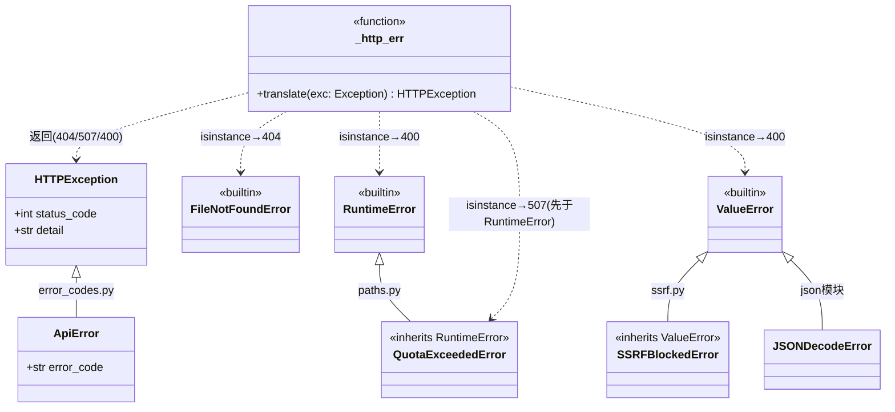
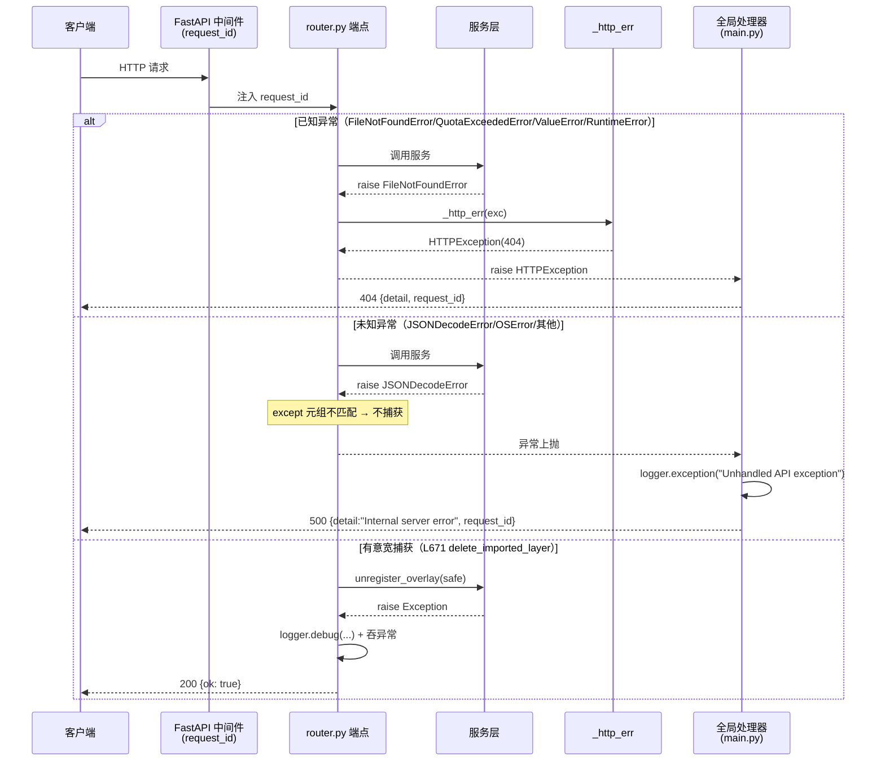
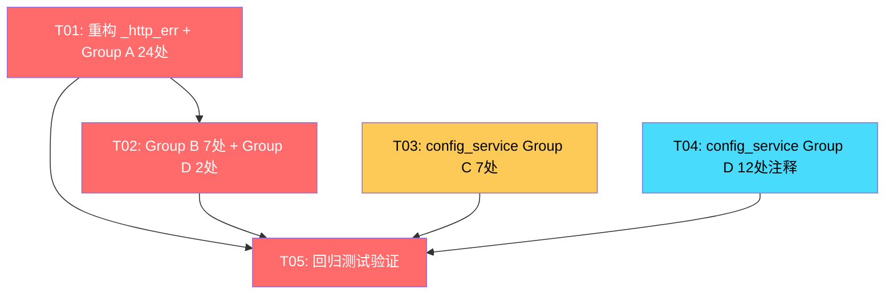

# 设计文档：API 异常边界收窄

> 架构师：高见远（Gao） | 阶段：架构设计 + 任务分解
> 目标文件：`Code/backend/app/data_io/api/router.py`（33 处）、`Code/backend/app/services/config_service.py`（19 处）
> 决策依据：产品经理许清楚增量 PRD + 主理人 Q1-Q6 决策

---

## 1. 收窄策略（实现方案）

### 1.1 核心思路

当前两个文件共 52 处 `except Exception`，分为四类，每类采用不同策略：

| 分组 | 文件 | 处数 | 当前行为 | 收窄策略 |
|------|------|------|----------|----------|
| **A 标准翻译类** | router.py | 24 | 任何异常→`_http_err`（含 500+str 泄露） | 仅捕获已知类型→`_http_err`；未知异常上抛全局处理器 |
| **B not_found 强转** | router.py | 7 | `not_found=True` 任何异常→404 | 去掉 `not_found=True`，显式捕获 `FileNotFoundError`→404；其余上抛 |
| **C 探测/测试函数** | config_service.py | 7 | 宽捕获返回失败元组，部分无日志 | SSRF 专捕 + 意外异常补 `logger.exception`，返回值形状不变 |
| **D 有意宽捕获** | router.py 2 + config_service.py 12 | 14 | `pass`/`logger.warning` | 补 `logger.debug`/注释说明意图；行为不变 |

### 1.2 Group A — 标准翻译类（router.py 24 处）

**统一收窄模式**（替代当前 `except Exception as exc: raise _http_err(exc) from exc`）：

```python
try:
    svc()
except (FileNotFoundError, QuotaExceededError, ValueError, RuntimeError) as exc:
    raise _http_err(exc) from exc
# 其余 Exception 不捕获 → 上抛全局处理器：500 + "Internal server error" + ERROR 日志
```

**关键设计决策——使用元组 except 而非分写多个 except 子句**：

PRD 原始模式建议分写 3 个 except（FileNotFoundError / QuotaExceededError / ValueError+RuntimeError），并强调"507 必须在 400 之前命中"。本设计改为**单一元组 except + `_http_err` 内部 isinstance 分发**，理由：

1. **消除排序风险**：`_http_err` 内部已按 `FileNotFoundError → QuotaExceededError → (ValueError, RuntimeError)` 顺序检查。`QuotaExceededError(RuntimeError)` 的 isinstance 检查在 `(ValueError, RuntimeError)` 之前，天然保证 507 先于 400 命中。元组 except 不涉及排序，工程师无需记住 except 顺序约束。
2. **DRY**：24 处只需一行 except，减少机械重复和出错概率。
3. **等价性**：`except (A, B, C, D) as exc: raise _http_err(exc)` 与分写四个 `except A as exc: raise _http_err(exc)` 语义完全一致——`_http_err` 的 isinstance 链完成类型分发。

**finally 块保留**：L309/L327（`await file.close()`）、L523/L802（`shutil.rmtree`）的 finally 块不受 except 收窄影响，原样保留。

### 1.3 Group B — not_found=True 强转 404（router.py 7 处）

**改造策略**：去掉 `not_found=True` 参数，改为显式 `except FileNotFoundError`。

- **P0（import_job_* 3 处）**：仅 `except FileNotFoundError as exc: raise _http_err(exc) from exc`。
  - `JSONDecodeError`（任务文件损坏）是 `ValueError` 子类，**不捕获**→上抛全局处理器→500+日志。
  - `OSError`（IO 故障）**不捕获**→上抛→500+日志。
  - 行为变更：损坏/IO 文件 404→500（这是 bug 修复，P0）。

- **P1-a（vector_meta/geojson/features/document_preview 4 处）**：
  - L535/L545/L815：`except FileNotFoundError as exc: raise _http_err(exc) from exc`，其余上抛。
  - L571 vector_features：`except (FileNotFoundError, ValueError) as exc: raise _http_err(exc) from exc`（额外捕获 ValueError 用于非法 where/sort→400），其余上抛。

### 1.4 Group C — config_service 探测/测试函数（7 处）

| 行号 | 函数 | 当前 | 收窄后 |
|------|------|------|--------|
| L361 | test_api_key tianditu SSRF | `except Exception`→"出站URL校验失败" | `except (SSRFBlockedError, ValueError)`→同文案；非SSRF异常落外层L435 |
| L390 | test_api_key baidu SSRF | 同上 | 同上 |
| L435 | test_api_key 外层 | `except Exception`→"测试失败"，无日志 | 补 `logger.exception`，返回值不变 |
| L507 | test_gee_account | `except Exception`→"测试失败"，无日志 | 补 `logger.exception`，返回值不变 |
| L530 | reload_gee_account_pool | `except Exception`→返回失败元组，无日志 | 补 `logger.exception`，返回值不变 |
| L1300 | update_weather_provider apply_config | `logger.warning` | `logger.error`（Q3 决策），保留返回成功 |
| L1598 | test_remote_storage_profile 外层 | `except Exception`→返回失败dict | 拆分：`(OSError,ConnectionError,TimeoutError)`预期不记日志 + `except Exception`记`logger.exception`，返回形状不变 |

**SSRFBlockedError 继承链**：`SSRFBlockedError(ValueError)`。`validate_outbound_url` 仅通过 `resolve_outbound_target` 抛出 `SSRFBlockedError`（协议非法/无主机/DNS解析失败/命中阻断地址）。`except (SSRFBlockedError, ValueError)` 中 SSRFBlockedError 显式列出以表意（技术上 `except ValueError` 即可覆盖，因 SSRFBlockedError 是其子类）。

### 1.5 Group D — 有意宽捕获（router.py 2 处 + config_service.py 12 处）

**router.py**：
- **L671 delete_imported_layer**：`except Exception: pass` → `except Exception: logger.debug("unregister_overlay best-effort cleanup failed for %s", safe)` + 注释"故意最后防线：overlay 注销失败不应阻塞图层删除"。
- **L647 patch_imported_layer_display_name**：删除 `except Exception as exc: raise _http_err(exc) from exc`，保留 `except FileNotFoundError`。未知异常上抛全局处理器。

**config_service.py（12 处）**：均已记日志（`logger.exception`/`logger.warning`），仅补注释说明"尽力而为副作用，不应阻塞主操作"。无行为变更。

### 1.6 是否抽取共享 helper

**建议：不抽取新的装饰器/上下文管理器**，理由：
1. 现有 `_http_err` 函数已是共享翻译点，重构后职责更清晰（仅翻译已知类型，未知 re-raise）。
2. router handler 全部是 async 函数，装饰器需处理 async，增加复杂度。
3. 收窄后的模式极简（一行元组 except + `raise _http_err(exc) from exc`），抽象收益低于成本。
4. Group C/D 的模式各不相同（探测函数返回元组、副作用吞异常），无法统一抽象。

---

## 2. 文件列表及相对路径

### 修改文件（2 个）

| 文件 | 改动处数 | 说明 |
|------|----------|------|
| `Code/backend/app/data_io/api/router.py` | 33 + 1（_http_err 重构） | Group A 24 + Group B 7 + Group D 2 + `_http_err` 重构 + 新增 `import logging` |
| `Code/backend/app/services/config_service.py` | 19 | Group C 7 + Group D 12 |

### 新增文件（1 个，测试）

| 文件 | 说明 |
|------|------|
| `Test/backend/test_exception_narrowing.py` | 行为变更回归测试：损坏任务文件→500、未知异常→500+"Internal server error" |

### 不修改但需理解的依赖文件

| 文件 | 作用 |
|------|------|
| `Code/backend/app/api/error_codes.py` | `ApiError(HTTPException)` + `C403001`/`C429001` 错误码规格 |
| `Code/backend/app/main.py` | 全局异常处理器（`unhandled_exception_handler`/`http_exception_handler`/`validation_exception_handler`） |
| `Code/backend/app/data_io/services/paths.py` | `QuotaExceededError(RuntimeError)` 定义 |
| `Code/backend/app/core/ssrf.py` | `SSRFBlockedError(ValueError)` + `validate_outbound_url` |
| `Code/backend/app/data_io/services/jobs.py` | `get_job()` 抛 `FileNotFoundError("任务不存在")` + `json.loads` 可能抛 `JSONDecodeError` |
| `Code/backend/app/api/config_routes.py` | config_service 返回值的 HTTP 翻译层（不改） |

---

## 3. 数据结构和接口

### 3.1 `_http_err` 重构签名

```python
# 重构前
def _http_err(exc: Exception, *, not_found: bool = False) -> HTTPException:
    if isinstance(exc, FileNotFoundError) or not_found:
        return HTTPException(status_code=404, detail=str(exc))
    if isinstance(exc, import_paths.QuotaExceededError):
        return HTTPException(status_code=507, detail=str(exc))
    if isinstance(exc, (ValueError, RuntimeError)):
        return HTTPException(status_code=400, detail=str(exc))
    return HTTPException(status_code=500, detail=str(exc))  # ← 信息泄露 + 无日志

# 重构后
def _http_err(exc: Exception) -> HTTPException:
    """将已知服务异常翻译为 HTTPException。

    仅处理三类已知异常：
    - FileNotFoundError → 404（预期缺失，不记 ERROR）
    - QuotaExceededError → 507（isinstance 检查在 RuntimeError 前，保证 507 先命中）
    - ValueError / RuntimeError → 400（客户端/业务校验）

    未知异常类型 re-raise——调用方应在 except 元组中仅捕获上述类型，
    让其余异常上抛至全局 unhandled_exception_handler。
    """
    if isinstance(exc, FileNotFoundError):
        return HTTPException(status_code=404, detail=str(exc))
    if isinstance(exc, import_paths.QuotaExceededError):
        return HTTPException(status_code=507, detail=str(exc))
    if isinstance(exc, (ValueError, RuntimeError)):
        return HTTPException(status_code=400, detail=str(exc))
    raise exc  # 防御性：不应到达，调用方仅传入已知类型
```

**变更要点**：
- 删除 `not_found` 参数（Group B 改造后无人使用）
- 删除 500 fallback（Q1 决策：未知异常上抛全局处理器，不保留 `str(exc)`）
- 末尾 `raise exc` 纯防御性——元组 except 保证只传入已知类型

### 3.2 类图



### 3.3 与全局处理器的交互

| 异常类型 | router 捕获? | 翻译路径 | 最终响应 |
|----------|-------------|----------|----------|
| FileNotFoundError | Group A/B 元组 except | `_http_err`→HTTPException(404) | `http_exception_handler`→404+detail+request_id |
| QuotaExceededError | Group A 元组 except | `_http_err`→HTTPException(507) | `http_exception_handler`→507+detail+request_id |
| ValueError/RuntimeError | Group A 元组 except | `_http_err`→HTTPException(400) | `http_exception_handler`→400+detail+request_id |
| JSONDecodeError(任务损坏) | P0 不捕获 | 上抛 | `unhandled_exception_handler`→500+"Internal server error"+ERROR日志+request_id |
| OSError/其他未知 | 不捕获 | 上抛 | `unhandled_exception_handler`→500+"Internal server error"+ERROR日志+request_id |
| RequestValidationError | 不捕获(框架层) | — | `validation_exception_handler`→422 |
| ApiError(C403001/C429001) | 不捕获(框架层) | — | `http_exception_handler`→401/403/429+error_code+request_id |

---

## 4. 程序调用流程（时序图）



---

## 5. 任务列表（有序、含依赖关系）

> 工程师：寇豆码。以下为执行清单，按依赖顺序排列。
> 测试命令：`CODEBUDDY_SESSION_ID= CLAUDE_SESSION_ID= CODEBUDDY_SAFE_DELETE_SANDBOX= Env/Python312/python.exe -m pytest Test/backend -p no:cacheprovider --basetemp="Test/.pytest-xxx"`

### T01: 重构 `_http_err` + router.py Group A 标准翻译类（24 处）

- **涉及文件**：`Code/backend/app/data_io/api/router.py`
- **依赖**：无（基础设施任务）
- **优先级**：P0

**步骤 1：重构 `_http_err`（L204-211）**

old:
```python
def _http_err(exc: Exception, *, not_found: bool = False) -> HTTPException:
    if isinstance(exc, FileNotFoundError) or not_found:
        return HTTPException(status_code=404, detail=str(exc))
    if isinstance(exc, import_paths.QuotaExceededError):
        return HTTPException(status_code=507, detail=str(exc))
    if isinstance(exc, (ValueError, RuntimeError)):
        return HTTPException(status_code=400, detail=str(exc))
    return HTTPException(status_code=500, detail=str(exc))
```

new:
```python
def _http_err(exc: Exception) -> HTTPException:
    """将已知服务异常翻译为 HTTPException。

    仅处理：FileNotFoundError→404、QuotaExceededError→507、
    ValueError/RuntimeError→400。未知类型 re-raise 上抛全局处理器。
    QuotaExceededError(RuntimeError) 的 isinstance 检查先于父类，保证 507 先命中。
    """
    if isinstance(exc, FileNotFoundError):
        return HTTPException(status_code=404, detail=str(exc))
    if isinstance(exc, import_paths.QuotaExceededError):
        return HTTPException(status_code=507, detail=str(exc))
    if isinstance(exc, (ValueError, RuntimeError)):
        return HTTPException(status_code=400, detail=str(exc))
    raise exc
```

**步骤 2：24 处 Group A 站点统一替换**

对以下 24 处，将 `except Exception as exc:` 替换为 `except (FileNotFoundError, QuotaExceededError, ValueError, RuntimeError) as exc:`（`raise _http_err(exc) from exc` 行不变，但去掉 `not_found=True` 如有——Group A 无 not_found）：

| # | 行号 | 函数 | 特殊注意 |
|---|------|------|----------|
| 1 | L267 | upload_init | — |
| 2 | L284 | upload_resumable_init | — |
| 3 | L294 | upload_status | — |
| 4 | L309 | upload_chunk | **保留 finally `await file.close()` (L311-312)** |
| 5 | L327 | upload_chunk_indexed | **保留 finally `await file.close()` (L329-330)** |
| 6 | L337 | upload_complete | — |
| 7 | L347 | upload_resumable_complete | — |
| 8 | L458 | import_batch | — |
| 9 | L497 | import_vector | — |
| 10 | L523 | import_vector_multipart | **保留 finally `shutil.rmtree` (L525-526)** |
| 11 | L584 | vector_feature_patch | — |
| 12 | L597 | vector_feature_batch | — |
| 13 | L607 | vector_field_add | — |
| 14 | L618 | vector_field_delete | — |
| 15 | L629 | vector_rename_field | — |
| 16 | L708 | raster_inspect | — |
| 17 | L758 | raster_commit | — |
| 18 | L772 | raster_detect_invalid | — |
| 19 | L785 | import_document | — |
| 20 | L802 | import_document_multipart | **保留 finally `await file.close()` + `shutil.rmtree` (L804-806)** |
| 21 | L825 | document_ops | — |
| 22 | L858 | document_commit | — |
| 23 | L880 | export_layer_endpoint | — |
| 24 | L923 | export_batch_endpoint | — |

每处替换示例（以 L267 为例）：
```python
# old
    except Exception as exc:
        raise _http_err(exc) from exc
# new
    except (FileNotFoundError, QuotaExceededError, ValueError, RuntimeError) as exc:
        raise _http_err(exc) from exc
```

**验收标准**：
1. `grep -n "except Exception" router.py` 仅剩 L671、L647 两处（Group D，T02 处理）
2. `grep -n "not_found" router.py` 仅剩 L645-646（T02 处理）
3. 现有测试 `test_reject_executable_extension`（evil.exe→ValueError→400）通过
4. 现有测试 `test_shp_sidecar_error_lists_received` 通过
5. 现有测试 import_batch 空 groups→400 通过
6. `_http_err` 签名无 `not_found` 参数

---

### T02: router.py Group B（not_found 7 处）+ Group D（2 处）

- **涉及文件**：`Code/backend/app/data_io/api/router.py`
- **依赖**：T01（`_http_err` 必须先重构，去掉 `not_found` 参数）
- **优先级**：P0（含 P0 级 import_job_* 3 处）

**步骤 1：新增 logging 导入**

在 router.py 顶部（L5 `import json` 附近）新增：
```python
import logging
```
在 `router = APIRouter(...)` 后新增：
```python
logger = logging.getLogger(__name__)
```

**步骤 2：P0 import_job_* 3 处（行为变更：损坏文件 404→500）**

L368-369 import_job_status:
```python
# old
    except Exception as exc:
        raise _http_err(exc, not_found=True) from exc
# new
    except FileNotFoundError as exc:
        raise _http_err(exc) from exc
```

L378-379 import_job_cancel: 同上替换。

L388-389 import_job_download: 同上替换。

**步骤 3：P1-a vector/document 4 处**

L535-536 vector_meta:
```python
# old
    except Exception as exc:
        raise _http_err(exc, not_found=True) from exc
# new
    except FileNotFoundError as exc:
        raise _http_err(exc) from exc
```

L545-546 vector_geojson: 同上。

L571-572 vector_features（额外捕获 ValueError→400）:
```python
# old
    except Exception as exc:
        raise _http_err(exc, not_found=True) from exc
# new
    except (FileNotFoundError, ValueError) as exc:
        raise _http_err(exc) from exc
```

L815-816 document_preview: 同 vector_meta。

**步骤 4：P2 L645-648 patch_imported_layer_display_name**

```python
# old
    except FileNotFoundError as exc:
        raise _http_err(exc, not_found=True) from exc
    except Exception as exc:
        raise _http_err(exc) from exc
# new
    except FileNotFoundError as exc:
        raise _http_err(exc) from exc
```
（删除 `except Exception` 块，未知异常上抛全局处理器）

**步骤 5：P2 L671-672 delete_imported_layer**

```python
# old
    except Exception:
        pass
# new
    except Exception:
        # 故意最后防线：overlay 注销失败不应阻塞图层删除
        logger.debug("unregister_overlay best-effort cleanup failed for %s", safe)
```

**验收标准**：
1. `grep -n "except Exception" router.py` 仅剩 L671 一处（已加 logger.debug）
2. `grep -n "not_found" router.py` 返回空（无残留）
3. `grep -n "raise _http_err(exc, not_found" router.py` 返回空
4. `grep -n "import logging" router.py` 有结果
5. import_job_status 对不存在 job_id 返回 404（FileNotFoundError）
6. import_job_status 对损坏 job 文件返回 500（JSONDecodeError 上抛）——需新增测试验证
7. 全部 33 处 `except Exception` 中 31 处已收窄，仅 L671 保留（有意宽捕获）

---

### T03: config_service.py Group C 探测/测试函数收窄（7 处）

- **涉及文件**：`Code/backend/app/services/config_service.py`
- **依赖**：无（独立于 T01/T02）
- **优先级**：P1

**步骤 1：L361 test_api_key tianditu SSRF 收窄**

在 L356 的 import 行补充 SSRFBlockedError：
```python
# old
            from app.core.ssrf import validate_outbound_url
# new
            from app.core.ssrf import SSRFBlockedError, validate_outbound_url
```
L360-363:
```python
# old
            try:
                validate_outbound_url(url, allow_private=False)
            except Exception as exc:
                repo.update_test_status(key_name, "failed")
                return False, f"出站 URL 校验失败: {exc}"
# new
            try:
                validate_outbound_url(url, allow_private=False)
            except (SSRFBlockedError, ValueError) as exc:
                repo.update_test_status(key_name, "failed")
                return False, f"出站 URL 校验失败: {exc}"
```

**步骤 2：L390 test_api_key baidu SSRF 收窄**

在 L385 的 import 行同样补充 SSRFBlockedError。L389-392 同 L361 模式替换。

**步骤 3：L435 test_api_key 外层补日志**

```python
# old
    except Exception as e:
        repo.update_test_status(key_name, "failed")
        return False, f"测试失败: {e}"
# new
    except Exception as e:
        logger.exception("test_api_key failed for key=%s", key_name)
        repo.update_test_status(key_name, "failed")
        return False, f"测试失败: {e}"
```

**步骤 4：L507 test_gee_account 补日志**

```python
# old
    except Exception as e:
        repo.update_test_status(account_id, "failed")
        return False, f"测试失败: {e}"
# new
    except Exception as e:
        logger.exception("test_gee_account failed for account=%s", account_id)
        repo.update_test_status(account_id, "failed")
        return False, f"测试失败: {e}"
```

**步骤 5：L530 reload_gee_account_pool 补日志**

```python
# old
    except Exception as e:
        return False, 0, f"重载失败: {e}"
# new
    except Exception as e:
        logger.exception("reload_gee_account_pool failed")
        return False, 0, f"重载失败: {e}"
```

**步骤 6：L1300 update_weather_provider apply_config 升级日志级别**

```python
# old
        except Exception as e:
            logger.warning("Failed to apply config to provider %s: %s", provider_id, e)
# new
        except Exception as e:
            logger.error("Failed to apply config to provider %s: %s", provider_id, e)
```
（Q3 决策：升 logger.error，保留返回成功，不加 runtime_apply_error 字段）

**步骤 7：L1598 test_remote_storage_profile 外层拆分**

```python
# old
    except Exception as exc:
        repo.update_test_status(profile_id, "failed")
        return {
            "profile_id": profile_id,
            "success": False,
            "message": str(exc),
            "tested_at": datetime.now(UTC).isoformat(),
        }
# new
    except (OSError, ConnectionError, TimeoutError) as exc:
        # 探测失败（连接拒绝/超时/认证失败等）——预期结果，不记 ERROR
        repo.update_test_status(profile_id, "failed")
        return {
            "profile_id": profile_id,
            "success": False,
            "message": str(exc),
            "tested_at": datetime.now(UTC).isoformat(),
        }
    except Exception as exc:
        # 意外错误——记录完整堆栈，但仍返回失败元组（形状不变）
        logger.exception("Unexpected error probing remote storage profile %s", profile_id)
        repo.update_test_status(profile_id, "failed")
        return {
            "profile_id": profile_id,
            "success": False,
            "message": str(exc),
            "tested_at": datetime.now(UTC).isoformat(),
        }
```

**验收标准**：
1. test_api_key 对 SSRF 阻断 URL 返回 `(False, "出站 URL 校验失败: ...")`，返回值形状不变
2. test_api_key 外层异常路径产生 ERROR 日志（可用 `caplog` 断言）
3. update_weather_provider apply_config 失败时仍返回 provider dict（成功），日志级别为 ERROR
4. test_remote_storage_profile 返回 dict 形状不变（4 个 key: profile_id/success/message/tested_at）
5. config_service 所有返回值形状不变（test_config_contracts.py / test_config_breaking_contracts.py 通过）

---

### T04: config_service.py Group D 尽力而为副作用注释（12 处）

- **涉及文件**：`Code/backend/app/services/config_service.py`
- **依赖**：无（独立于 T01/T02/T03，修改不同行号）
- **优先级**：P2

对以下 12 处已有的 `except Exception` 块，**仅补充注释说明意图，不改变任何代码逻辑**（已有 `logger.exception`/`logger.warning`，保留）：

| # | 行号 | 函数/上下文 | 补充注释 |
|---|------|------------|----------|
| 1 | L186 | upsert_api_key→hydrate_effective_config | `# 尽力而为：effective config rehydrate 失败不应阻塞 API Key 写入` |
| 2 | L236 | delete_api_key→hydrate_effective_config | 同上 |
| 3 | L279 | toggle_api_key→hydrate_effective_config | 同上 |
| 4 | L307 | _sync_api_config_manager_key | `# 尽力而为：ApiConfigManager 同步失败不应阻塞 Key 操作` |
| 5 | L519 | _reload_gee_facade | `# 尽力而为：facade 重载失败不影响账户变更已持久化` |
| 6 | L1137 | _ensure_weather_providers_registered | `# 尽力而为：惰性注册失败不应阻塞配置读取` |
| 7 | L1199 | list_weather_providers→legacy purge | `# 尽力而为：遗留 open-meteo 清理失败不应阻塞列表返回` |
| 8 | L1384 | delete_weather_provider→apply_config({}) | `# 尽力而为：重置 config 失败不应阻塞 DB 删除` |
| 9 | L1620 | apply_persisted_provider_overrides→list_providers | `# 尽力而为：DB 读取失败时回退到默认配置` |
| 10 | L1648 | apply_persisted_provider_overrides→legacy purge | `# 尽力而为：遗留行清理失败不阻塞覆盖应用` |
| 11 | L1678 | apply_persisted_provider_overrides→migrate priorities | `# 尽力而为：优先级迁移失败不阻塞覆盖应用` |
| 12 | L1697 | apply_persisted_provider_overrides→apply_config | `# 尽力而为：单个 provider config 应用失败不阻塞其余` |

注释插入位置：在 `except Exception` 行上方或 `logger.xxx(...)` 行上方。

**验收标准**：
1. `grep -c "except Exception" config_service.py` = 19（7 处 Group C 已收窄/改写 + 12 处 Group D 保留）
   - 注意：Group C 的 L361/L390 改为 `except (SSRFBlockedError, ValueError)`，L1598 拆为两块（其中一块仍是 `except Exception`），所以 `except Exception` 计数 = 12(D) + 4(C: L435/L507/L530/L1300) + 1(C: L1598 第二块) = 17，另 L361/L390 变为非 Exception = 2，总计 19 处 except 子句
2. 无行为变更——所有现有测试通过
3. 每处注释清晰表达"尽力而为"意图

---

### T05: 回归测试验证

- **涉及文件**：`Test/backend/test_exception_narrowing.py`（新增）、`Test/backend/test_import_data_io.py`（现有）、`Test/backend/test_error_handlers.py`（现有）
- **依赖**：T01、T02、T03、T04（全部完成后验证）
- **优先级**：P0

**步骤 1：运行现有测试套件**

```bash
CODEBUDDY_SESSION_ID= CLAUDE_SESSION_ID= CODEBUDDY_SAFE_DELETE_SANDBOX= \
Env/Python312/python.exe -m pytest Test/backend -p no:cacheprovider --basetemp="Test/.pytest-xxx"
```

重点验证：
- `test_import_data_io.py`：test_reject_executable_extension、test_reject_zip_path_traversal、test_shp_sidecar_error_lists_received
- `test_error_handlers.py`：test_internal_error_includes_request_id（500→"Internal server error"）
- `test_config_contracts.py`、`test_config_breaking_contracts.py`：config_service 返回值形状
- `test_import_quota_reimport.py`：QuotaExceededError→507

**步骤 2：新增行为变更回归测试** `Test/backend/test_exception_narrowing.py`

测试用例：
1. **损坏任务文件→500**：创建 job 目录，写入损坏 JSON，GET /import/jobs/{job_id} 应返回 500 + "Internal server error"（验证 JSONDecodeError 不再被 not_found=True 转为 404）
2. **不存在任务→404**：GET /import/jobs/nonexistent 应返回 404 + "任务不存在"（FileNotFoundError 正确映射）
3. **未知异常→500+"Internal server error"**：mock 服务层抛 OSError，验证 500 + detail 不含 str(exc) + request_id 存在
4. **QuotaExceededError→507**：mock 服务层抛 QuotaExceededError，验证 507（507-before-400 排序）
5. **ValueError→400**：mock 服务层抛 ValueError，验证 400 + detail 含原消息
6. **delete_imported_layer overlay 注销失败→仍 200**：mock unregister_overlay 抛异常，验证 200 + ok:true

**验收标准**：
1. 现有全部测试通过（0 regression）
2. 新增 6 个测试用例全部通过
3. 无 `except Exception` 残留在 router.py（除 L671 有意宽捕获）

---

## 6. 依赖包列表

**无需新增任何第三方依赖。** 所有改动基于现有标准库（`logging`、`json`）和已安装框架（FastAPI、httpx）。

---

## 7. 共享知识（跨文件约定）

### 7.1 except 顺序约束

`QuotaExceededError(RuntimeError)` 是 RuntimeError 子类。`_http_err` 内部 isinstance 链已保证 `QuotaExceededError` 检查（→507）先于 `(ValueError, RuntimeError)` 检查（→400）。**工程师无需在 except 子句中手动排序**——使用元组 except + `_http_err` 分发即可。

若未来有人分写 except 子句，**必须** `except QuotaExceededError` 在 `except RuntimeError` 之前。

### 7.2 `_http_err` 翻译器使用约定

- **仅传入已知类型**：`FileNotFoundError`、`QuotaExceededError`、`ValueError`、`RuntimeError`。
- **不传入未知类型**：未知异常应让其自然上抛，由全局处理器兜底。
- **不再有 `not_found` 参数**：所有"预期缺失"场景通过显式 `except FileNotFoundError` 处理。
- **不再有 500 fallback**：`_http_err` 不再返回 500+str(exc)，防止信息泄露。

### 7.3 全局处理器兜底约定

未知异常上抛后由 `main.py` 的 `unhandled_exception_handler` 处理：
- 状态码：500
- 响应体：`{"detail": "Internal server error", "request_id": "..."}`
- 日志：`logger.exception("Unhandled API exception")`（含完整堆栈 + request_id）
- **不泄露 str(exc)**：响应体固定文案，服务端路径等敏感信息仅出现在日志中

### 7.4 config_service 返回值不变约定

- `test_api_key` → `(bool, str)` 元组
- `test_gee_account` → `(bool, str)` 元组
- `reload_gee_account_pool` → `(bool, int, str)` 三元组
- `test_remote_storage_profile` → `dict` 含 `profile_id/success/message/tested_at`
- `update_weather_provider` → `dict | None`（provider 详情或 None）
- 本次改动**不新增任何返回字段**（Q3 决策：不加 runtime_apply_error）

### 7.5 测试约定

- 测试目录：`Test/backend/`
- 运行命令：`CODEBUDDY_SESSION_ID= CLAUDE_SESSION_ID= CODEBUDDY_SAFE_DELETE_SANDBOX= Env/Python312/python.exe -m pytest Test/backend -p no:cacheprovider --basetemp="Test/.pytest-xxx"`
- 唯一 Python：`Env/Python312/python.exe`
- 行为变更测试文件命名：`test_exception_narrowing.py`
- 现有契约测试不可破坏：`test_import_data_io.py`、`test_error_handlers.py`、`test_config_contracts.py`、`test_config_breaking_contracts.py`

### 7.6 finally 块保留约定

以下 4 处 finally 清理块**必须原样保留**，不受 except 收窄影响：
- L309-312 upload_chunk：`finally: await file.close()`
- L327-330 upload_chunk_indexed：`finally: await file.close()`
- L523-526 import_vector_multipart：`finally: shutil.rmtree(tmp, ignore_errors=True)`
- L802-806 import_document_multipart：`finally: await file.close(); shutil.rmtree(tmp, ignore_errors=True)`

---

## 8. 任务依赖图



**并行机会**：T03 和 T04 修改 config_service.py 的不同行号，与 T01/T02 修改 router.py 完全独立，可并行执行。T01→T02 必须串行（T02 依赖 T01 的 `_http_err` 重构）。

---

## 9. 待明确事项

### 9.1 L571 vector_features 的 ValueError 来源

PRD 指出 L571 应额外捕获 `ValueError`（非法 where/sort→400）。经核查 `list_vector_features` 及 `_match_where`，当前代码中 where/sort 解析未显式抛 ValueError（`_match_where` 静默跳过不匹配子句）。PRD 可能是前瞻性设计（未来增加 where 语法校验）或考虑 `load_vector_geojson` 内 `json.loads` 的 `JSONDecodeError`（ValueError 子类）。

**处理**：按 PRD 要求捕获 `(FileNotFoundError, ValueError)`。若 `load_vector_geojson` 读取损坏 geojson 抛 JSONDecodeError，将被映射为 400 而非 500。这与 Group A 的行为一致（ValueError→400），可接受。如主理人认为损坏 geojson 应为 500，需进一步确认。

### 9.2 `_http_err` 末尾 `raise exc` 的防御性

重构后 `_http_err` 末尾 `raise exc` 在正常流程中不可达（元组 except 保证只传入已知类型）。若未来有人误传未知类型，`raise exc` 会将其上抛至全局处理器——这是期望行为。但 `raise _http_err(exc) from exc` 语法上要求 `_http_err` 返回值可 raise。当 `_http_err` 内部 raise exc 时，`from exc` 不执行，异常直接从 `_http_err` 内部传播，traceback 完整保留。**无问题**。

### 9.3 L1598 OSError 元组是否充分

`test_remote_storage_profile` 外层拆分为 `except (OSError, ConnectionError, TimeoutError)`（预期）+ `except Exception`（意外）。`probe_remote_connectivity`/`probe_remote_uri` 可能抛出的异常类型未完全确认（可能包括 smbclient 特定异常、paramiko 异常等）。若这些异常不是 OSError 子类，会被归入"意外"并记 logger.exception，虽然略吵但行为安全（返回形状不变）。**可接受，后续可根据实际日志调整元组**。

---

## 附录：全部 52 处变更速查表

### router.py（33 处）

| 行号 | 函数 | 分组 | 改动摘要 |
|------|------|------|----------|
| L204 | _http_err | 基础设施 | 删 not_found 参数 + 删 500 fallback + 末尾 raise exc |
| L267 | upload_init | A | except→元组 |
| L284 | upload_resumable_init | A | except→元组 |
| L294 | upload_status | A | except→元组 |
| L309 | upload_chunk | A | except→元组，保留 finally |
| L327 | upload_chunk_indexed | A | except→元组，保留 finally |
| L337 | upload_complete | A | except→元组 |
| L347 | upload_resumable_complete | A | except→元组 |
| L368 | import_job_status | B-P0 | except Exception→except FileNotFoundError |
| L378 | import_job_cancel | B-P0 | except Exception→except FileNotFoundError |
| L388 | import_job_download | B-P0 | except Exception→except FileNotFoundError |
| L458 | import_batch | A | except→元组 |
| L497 | import_vector | A | except→元组 |
| L523 | import_vector_multipart | A | except→元组，保留 finally |
| L535 | vector_meta | B-P1a | except Exception→except FileNotFoundError |
| L545 | vector_geojson | B-P1a | except Exception→except FileNotFoundError |
| L571 | vector_features | B-P1a | except Exception→except (FileNotFoundError, ValueError) |
| L584 | vector_feature_patch | A | except→元组 |
| L597 | vector_feature_batch | A | except→元组 |
| L607 | vector_field_add | A | except→元组 |
| L618 | vector_field_delete | A | except→元组 |
| L629 | vector_rename_field | A | except→元组 |
| L647 | patch_display_name | D-P2 | 删 except Exception，保留 except FileNotFoundError |
| L671 | delete_imported_layer | D-P2 | pass→logger.debug+注释 |
| L708 | raster_inspect | A | except→元组 |
| L758 | raster_commit | A | except→元组 |
| L772 | raster_detect_invalid | A | except→元组 |
| L785 | import_document | A | except→元组 |
| L802 | import_document_multipart | A | except→元组，保留 finally |
| L815 | document_preview | B-P1a | except Exception→except FileNotFoundError |
| L825 | document_ops | A | except→元组 |
| L858 | document_commit | A | except→元组 |
| L880 | export_layer_endpoint | A | except→元组 |
| L923 | export_batch_endpoint | A | except→元组 |

### config_service.py（19 处）

| 行号 | 函数 | 分组 | 改动摘要 |
|------|------|------|----------|
| L186 | upsert_api_key | D | 补注释 |
| L236 | delete_api_key | D | 补注释 |
| L279 | toggle_api_key | D | 补注释 |
| L307 | _sync_api_config_manager_key | D | 补注释 |
| L361 | test_api_key SSRF | C | except→(SSRFBlockedError, ValueError) |
| L390 | test_api_key SSRF | C | except→(SSRFBlockedError, ValueError) |
| L435 | test_api_key 外层 | C | 补 logger.exception |
| L507 | test_gee_account | C | 补 logger.exception |
| L519 | _reload_gee_facade | D | 补注释 |
| L530 | reload_gee_account_pool | C | 补 logger.exception |
| L1137 | _ensure_weather_providers | D | 补注释 |
| L1199 | list_weather_providers | D | 补注释 |
| L1300 | update_weather_provider | C | warning→error |
| L1384 | delete_weather_provider | D | 补注释 |
| L1598 | test_remote_storage | C | 拆分预期/意外 |
| L1620 | apply_persisted_overrides | D | 补注释 |
| L1648 | apply_persisted_overrides | D | 补注释 |
| L1678 | apply_persisted_overrides | D | 补注释 |
| L1697 | apply_persisted_overrides | D | 补注释 |
