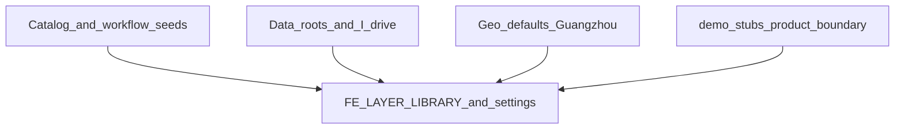

# CGDA 写死点与生产扩展面审计

**日期**：2026-08-05  
**范围**：产品目录 / 数据路径 / 地理与天气默认 / UI 文案与设置 / 运维简表  
**方法**：前后端对照核对；批 1 已实施路径真源统一，批 2/3 按计划落地配置化  
**交叉引用**：缺陷审查见 [`.ai/progress/2026-08-05-post-commit-bug-review.md`](../../progress/2026-08-05-post-commit-bug-review.md)；改造进度见 [`.ai/progress/2026-08-05-hardcode-fix.md`](../../progress/2026-08-05-hardcode-fix.md)

## TL;DR

系统原按**单机构实验室联调**假设构建。批 1 已切断算法/路由/overlay 的 `I:\` 静默回退，production 空 `BACKEND_DATA_ROOT` 拒启；本机联调须在 `.env` 显式设置数据根。批 2/3 继续目录门禁、地理同源与白标。

**2026-08-06**：数据根已支持前端「设置 → 数据源」写入 `.env`，并经 `POST /config/service/restart` / `launch.py restart backend` 热切换进程组（不动 Docker/Vite）。示例盘符仅出现在 `.env.example` / 实验室文档，不当作代码默认值。

---

## 扩展点矩阵

列说明：`覆盖` = 现有 env/DB/配置能否改掉默认；`风险` = 交付另一机构/生产时的跨环境风险。

### A. 产品 / 业务（与 UI 强绑定）

| ID | 写死内容 | 后端/算法真源 | 前端/UI 真源 | 覆盖 | 风险 | 状态 |
|----|----------|---------------|--------------|------|------|------|
| A-01 | 图层目录双份：`layer_id`/`catalogId` 静态表 | `layer_descriptors.json`、`weather_descriptors.json` | `catalog.ts`；`LayerSidebar.vue` | 部分 | **高** | **已修（批2）**：`check:catalog` 门禁 |
| A-02 | 实验切片 / `status: placeholder` | `layer_descriptors.json` | `catalog.ts` | 否 | **高** | **已修（批2）**：非 development 过滤 |
| A-03 | FE `dataOwner: 'Lab' \| 'Liuzheng'` | `data_owner` | `catalog.ts` | 否 | 中 | 延期（非阻断） |
| A-04 | 课题组二级分类写死 pills | 种子 `sub_category` | `LayerSidebar.vue` | 否 | 中 | **已修（批2）**：动态 pills |
| A-05 | 系统工作流种子含本机路径 | `workflow_seeds/system/*` | 工作流列表 | 否→`{DATA_ROOT}` | **高** | **已修（批1）**：占位展开 |
| A-06 | FE 写死 SF 种子桥接 | descriptor `workflow_id` | `layers/index.ts` | 否 | **高** | **已修（批2）**：读 descriptor |
| A-07 | 未实现节点 stub（GIS/stats/viz/fusion 等） | `node_template_registry.py`（`executable: False`）；`BACKEND_NODE_STUBS_VISIBLE` | `WorkflowNodePalette.vue`：`showStubs` 默认 false +「显示未实现」勾选 | env 控制生产隐藏 | 中 | 生产彻底禁 stub API；机构可见节点白名单 |
| A-08 | `demo://` 占位抓取 | `DemoSourceFetcher`；`BACKEND_DEMO_SOURCES_ENABLED`（默认关）；无 URI map 时回落 demo | 下载链路；工作流列表 `demo` 类别 | env | 中 | 保持 production fail；勿开演示开关上正式环境 |
| A-09 | 下载/预处理专用表单枚举节点 type | 后端节点 type 字符串 | `DownloadNodeForm.vue`、`NsidcDownloadForm`/`GldasDownloadForm`/`FyPreprocessForm`/`SshSyncForm`；`litegraph-setup.ts` 别名 | 否 | 中 | 注册表驱动表单，避免前端枚举机构私有节点 |

### B. 数据面 / 路径真源

| ID | 写死内容 | 后端/算法真源 | 前端/UI 真源 | 覆盖 | 风险 | 建议配置化 |
|----|----------|---------------|--------------|------|------|------------|
| B-01 | Runtime 默认根曾绑实验室盘 | `BACKEND_RUNTIME_ROOT`；`.env.example` | 无直接 UI | **是** env | **高** | **已修（批1）**：示例标明实验室；须显式 env |
| B-02 | `BACKEND_DATA_ROOT` 默认真空 | `config.py` + `assert_data_root_policy` | 数据源设置 | 是 | **高** | **已修（批1）**：production 空根拒启；**2026-08-06**：FE/API 可写 `.env` + `restart backend` |
| B-03 | 算法包曾默认/回退 `I:\Geograph_DataSet` | `dataset_config.py` | readiness | 须 env | **高** | **已修（批1）**：无 env 抛清晰异常；pytest fixture 注入 |
| B-04 | Launch `.data` 与 runtime 双轨 | `launch/constants.py` | 无 | 文档 | 中 | **已修（批1）**：双轨说明 |
| B-05 | Overlay 硬编码 `I:\...` | `overlay_registry.py` | overlay 上图 | 相对 data_root | **高** | **已修（批1）**：`_data_join`；空根则不可用 |
| B-06 | 工作流产物回退写死 I: | `workflow_router.py` | 结果上图 | workspace+data_root | **高** | **已修（批1）** |
| B-07 | 节点表单本机路径占位 | — | 三下载/SSH 表单 | 空占位 | **高** | **已修（批1）** |
| B-08 | `source_uri_map.example.json` 实验室 URI | 示例 | 下载节点 | 是 | 中 | **已修（批2）**：`_readme` 机构模板说明 |
| B-09 | `DATASET_REGISTRY` 相对目录树 | `dataset_config.py` | readiness | 根可改 | **高** | 延期（树布局机构映射另立） |

### C. 地理 / 天气 / 地图默认

| ID | 写死内容 | 后端/算法真源 | 前端/UI 真源 | 覆盖 | 风险 | 建议配置化 |
|----|----------|---------------|--------------|------|------|------------|
| C-01 | 天气默认点广州 | `weather_default_*` | 点查默认 | **是** env | 中 | **可配**：机构 `.env` |
| C-02 | 地图初始中心/缩放 | `BACKEND_MAP_DEFAULT_*` → `/config/general` | `map-defaults` + map-canvas | **是** | 中 | **已修（批2）** |
| C-03 | 天气视口初始 | 同上 | `weather-viewport.ts` 读 map-defaults | **是** | 中 | **已修（批2）** |
| C-04 | 默认天气模型 | `BACKEND_WEATHER_DEFAULT_MODEL` | bootstrap + `/config/weather` 覆盖 | 部分 | 中 | **已修（批2）**：冷启动 bootstrap，配置后覆盖 |
| C-05 | Bbox 预设 | `BACKEND_MAP_AOI_PRESETS` | `BboxInputField` 中国/全球+机构项 | **是** | 中 | **已修（批2）** |
| C-06 | 图层 extent | catalog seeds | 定位到图层 | 否 | 中 | 延期 |
| C-07 | 默认底图 | `map_default_tile_source` | `getDefaultTileSource()` | **是** | 中 | **已修（批2）** |

### D. UI 文案 / 设置 / 品牌

| ID | 写死内容 | 后端/算法真源 | 前端/UI 真源 | 覆盖 | 风险 | 建议配置化 |
|----|----------|---------------|--------------|------|------|------------|
| D-01 | 品牌文案 | README | `brand.ts`（`VITE_BRAND_*`） | 构建期 | 中 | **已修（批3）** |
| D-02 | 「课题组」叙事 | categories | `ORG_LABEL` / `VITE_ORG_LABEL` | 构建期 | 中 | **已修（批3）** |
| D-03 | 设置 Tab 集合 | `/config/*` | `VITE_SETTINGS_TABS` | 构建期 | 中 | **已修（批3）** |
| D-04 | 单写密钥存浏览器 `localStorage` | `backend_auth` DB/env | `ApiKeySettings.vue`；`backend-auth.ts`（已无 `VITE_BACKEND_API_KEY`） | 运行时写入 | **高**（多用户） | 会话/SSO；勿多用户共享一把 Key（产品边界已声明单 Key） |
| D-05 | 远程存储/门户表单协议与 portal 键写死 | remote profiles；Earthdata/NSIDC/… | `RemoteStorageSettings`；`DataSourceSettings` | DB 可存 profile | 中 | 机构预置 NAS/SSH 模板 |
| D-06 | Open-Meteo 模型 fallback 列表 | sync config | `OpenMeteoSyncSettings.vue` `FALLBACK_MODELS` | 部分 API | 低 | 以后端列表为唯一真源 |
| D-07 | 全中文 ui-copy，无 i18n/白标钩子 | — | `ui-copy/*` | 否 | 低–中 | 文案包；按需 i18n |

### E. 运维 / 安全（简表；细节见审查报告）

| ID | 写死内容 | 真源 | UI | 覆盖 | 风险 | 建议 |
|----|----------|------|-----|------|------|------|
| E-01 | MinIO 默认 `minioadmin`/`minioadmin` | `docker-compose.yml` | MinIO Console | env | **高** | **已修（批1）**：compose/`.env.example` 强调生产必改 |
| E-02 | Redis 无 `requirepass`（已绑 `127.0.0.1`） | compose | 无 | 否 | 中 | Known；本计划不纳入 |
| E-03 | SSH 默认用户曾写实验室账号 | `config.py` `BACKEND_SSH_*` | 远程表单 | env | **高** | **已修（批1）**：默认空串 |
| E-04 | CORS 默认 localhost:5173–5176 | `config.py` | 浏览器跨域 | env | 中 | 生产收窄域名 |
| E-05 | `BACKEND_RELOAD` 默认 `true` | `config.py` | 无 | env | 中 | 生产显式 false |
| E-06 | `trust_proxy` 默认 false | `config.py`；限流 `client_ip` | 无直接 UI | env | 低（正确默认） | 仅受信 gateway 后开启 |
| E-07 | Workflow Celery `soft_time_limit=7200` / `time_limit=7500` 代码写死 | `workflow_tasks.py` | 工作流长时间运行/看门狗阈值 | visibility/watchdog 有 env | 中 | 与配置对齐或可 env |
| E-08 | 发布边界：单机构 / 单 API Key / SQLite | README / AGENTS | About 架构叙事 | 产品决策 | **高**（若承诺多租户） | 保持边界或单独立项多租户 |

---

## UI 走查清单（文字级）

| 界面 | 可见写死/机构绑定 |
|------|-------------------|
| 图层库侧栏 | 静态目录 + 课题组 pills + Lab/Liuzheng 归属 + 实验层 ID |
| 地图首屏 | 中心广州；默认高德底图 |
| 天气时间轴/模型 | bootstrap `ecmwf_ifs025`；视口广州 |
| 工作流节点面板 | stub 勾选；下载表单 I: 占位 |
| 工作流列表 | system/demo 种子；本机路径模板 |
| SF 反演链路 | 前端写死 `omega_sf_fenkuai_smap_single` |
| 设置 → API Key | 单 Key localStorage |
| 设置 → 远程/数据源/Open-Meteo | 协议与模型列表写死 + 可配项 |
| 关于/顶栏 | BRAND 固定中文名 |
| Bbox 控件 | 仅中国/全球预设 |

---

## 分批改造路线图（实施状态）

进度页：[`.ai/progress/2026-08-05-hardcode-fix.md`](../../progress/2026-08-05-hardcode-fix.md)。交付清单：[delivery-checklist.md](./delivery-checklist.md)。

| 批次 | 状态 |
|------|------|
| 批 1 路径真源 | **完成** |
| 批 2 目录/地理/种子 | **完成** |
| 批 3 白标与设置 Tab | **完成**（多租户不在范围） |

---

## 验收对照

- [x] 矩阵覆盖 A–E，每条含 UI 或标明「无直接 UI」
- [x] 三批路线图含触及文件与依赖
- [x] 进度指针见 [`.ai/progress/2026-08-05-hardcode-extension-audit.md`](../../progress/2026-08-05-hardcode-extension-audit.md)
