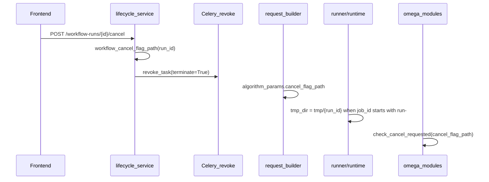
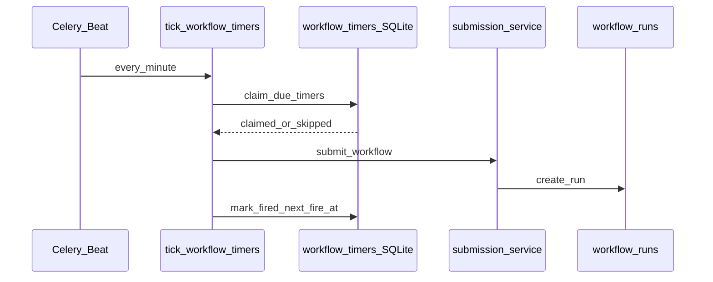

# 工作流设计与调度系统全链路审计报告

> 生成/更新日期：2026-08-04  
> 范围：workflow-runs 主链（不含天气瓦片热路径、旧 `/tasks` 桥接）

## 1. 分域对照表

| 域 | 结论 | 摘要 |
|----|------|------|
| 3.1 模块节点与系统设置 | **通过** | Fy/Gldas/Nsidc/SshSync 均已接入 `system-settings-fill`；BE 模板仍无 `system_settings_key` 元数据 |
| 3.2 运行前检查 | **通过** | FE validator + BE compile + 提交前 `POST /dry-validate`（V-01） |
| 3.3 任务启动与调度 | **通过** | 容量原子预留、队列查表、local-submit 护栏、429 退避均已实现 |
| 3.4 详细进度监视 | **通过** | node_progress 事件链完整；壳层按 `updatedAt` + `eventId` 选取最新节点（V-02） |
| 3.5 多进程与多线程 | **通过** | Celery solo + 算法 spawn 池；`_parallel.py` 文档化进程爆炸防护 |
| 3.6 日志结构化 | **部分** | 后端 JSON 日志 + SQLite 事件；子进程 run_id 与 FE 5/40 条分层未统一文档 |
| 3.7 任务重启与缓存复用 | **通过** | `reuse_cache.py` 按 metadata/products/request 解析 `reuse_output_dir` |
| 3.8 结果图层组产出与命名 | **通过** | RunDialog + run-layer-group + formatRunResultLayerName 主链完整 |
| 3.9 实时结果与时间轴 | **部分** | 8s progressive materialize + 失败 UI/diagnostics（P-01）；MapCanvas 不随 node_progress.timeKey 自动 seek |
| 3.10 任务取消 | **通过** | lifecycle 写旗标 + bridge 注入 `cancel_flag_path` + runner 稳定 `tmp/{run_id}` + omega 模块检查点 |
| 3.11 UI 状态与进度同步 | **通过** | tracked-runs 恢复 poll；submit 超时已接入 `claimOrphanWorkflowRun` |
| 3.12 文字与 UX | **部分** | `WORKFLOW_COPY` 已有骨架；layers store 429 等仍有硬编码中文 |
| 3.13 工作流定时器 / Beat | **通过（已加固）** | cron/interval/event；Asia/Shanghai 墙钟；乐观 claim 防双触发；按 engine 注入提交体 |

## 2. 问题单（按优先级）

### P0（已实施）

| ID | 问题 | 文件 | 修复 |
|----|------|------|------|
| C-01 | cancel 旗标与 provider tmp_dir 不一致 | `runner/runtime.py` | workflow run 使用稳定 `tmp/{run_id}` |
| C-02 | `cancel_flag_path` 未注入 algorithm_params | `python_provider_request_builder.py`, `cancel_paths.py` | 提交时 setdefault |
| C-03 | 长任务 module 未读 cancel 旗标 | `omega_sf_fenkuai.py`, `omega_avg_daily.py`, `cancel_utils.py` | 传入 `retrieve_*` / `check_cancel_requested` |
| C-04 | lifecycle 硬编码 cancel 路径 | `lifecycle_service.py` | 复用 `workflow_cancel_flag_path` |
| R-01 | Retry 硬编码 `products/omega_sf_fenkuai` | `retry_dispatcher.py`, `reuse_cache.py` | 多级解析 reuse_output_dir |

### P1（已实施 / 残留）

| ID | 问题 | 状态 |
|----|------|------|
| V-01 | 画布提交未调用 dry-validate | **已实施**（DashboardView → `POST /dry-validate`；HTTP 单测 `test_workflow_dry_validate.py`；编译后按 `params.module_name` 识别模块） |
| V-02 | `node_progress` 按最大 progress 选取 | **已实施**（`pickLatestNodeProgress`：`updatedAt` + `eventId` 平局） |
| P-01 | progressive 物化失败无 UI | **已实施**（`progressiveOverlayError` + diagnosticNotes + 状态面板区分色） |
| P-02 | 时间轴不随 node_progress.timeKey seek | **已实施**（`useTimelineSync.ts`：node_progress hint → 守卫（locked/playing/layerTimeLocked）→ `applyDateHour` seek；测试 `Test/frontend/views/dashboard/useTimelineSync.test.ts` + `Test/frontend/utils/workflow-timekey-seek.test.ts`） |

### P2（体验）

| ID | 问题 | 建议 |
|----|------|------|
| S-01 | BE 无 path 字段与系统设置契约 | node_template_registry 增加 `system_settings_key` |
| T-01 | 散落硬编码文案 | 迁入 `WORKFLOW_COPY` |
| T-02 | 英文 bridge 错误 | `result-adapter` error_code 映射 |

## 3. 取消链路审计（3.10）

**Windows solo 行为**：`revoke_task(terminate=True)` 不保证清理 spawn 子进程树；协作式 cancel 为必要补充。

## 4. 重试缓存审计（3.7）

`reuse_cache.resolve_reuse_output_dir` 优先级：

1. `executor_metadata.reuse_output_dir`
2. `result_dto.products` 中 block/mat 路径
3. 原请求 `algorithm_params.output_dir` / `output_spec.extra`
4. 默认 `products/{module_name}`（omega 系模块）

## 5. 系统设置表单审计（3.1）

| 表单 | 路径字段 | system-settings-fill |
|------|----------|----------------------|
| FyPreprocessForm | input_dir, output_dir | **已接入**（dataRoot / outputRoot） |
| GldasDownloadForm | local_dir | **已接入**（dataRoot） |
| NsidcDownloadForm | local_dir | **已接入**（dataRoot） |
| SshSyncForm | local_path | **已接入**（dataRoot） |
| DownloadNodeForm | （路由壳） | N/A |

## 6. UI 路径审计（3.11）

- **`runWorkflowForCatalog`**：`localSubmitJobId` 乐观 ID → 真实 run_id；submit 超时调用 `claimOrphanWorkflowRun`（`isSubmitTimeoutError` 分支）。
- **`tracked-workflow-runs`**：localStorage 恢复 poll，最多 40 条。
- **`bindRunIdToGroup`**：绑定 group 级 runId。

## 7. 时间轴联动审计（3.9）

- `layer-temporal.ts` 从 `importedRaster.timeList/timeSlices` 解析，**不**读取 workflow `node_progress.detail.timeKey`。
- `MapCanvas.vue` 无 node_progress → timeline seek 逻辑。
- progressive overlay：`syncProgressiveBlockOverlays` 8s 节流，失败仅 `console.warn`。

## 7b. 工作流定时器 / Beat（3.13）

> 实现：`app/services/workflow_timer_service.py`、`app/api/routers/workflow_timer_router.py`、`app/tasks/workflow_timer_tasks.py`；FE `WorkflowTimerPanel.vue`。
> 规范：`.ai/docs/specs/workflow_seed_conventions.md`、`.ai/skills/workflow-design.md`。

| 项 | 结论 |
|----|------|
| 触发类型 | `cron` / `interval`（≥60s）/ `event` |
| 墙钟 | Cron 与日期模板按 **Asia/Shanghai**；`next_fire_at` 存 UTC ISO |
| Beat | `tick-workflow-timers` 每分钟 → `tick_workflow_timers` → 队列 `workflow_queue_standard` |
| 防双触发 | `claim_due_timers` 乐观锁（`CLAIMED:` 哨兵）；竞争计入 `skipped`；超时 CLAIMED（默认 TTL 300s，看 `updated_at`）在 `tick` 开头 `reclaim_stale_claims` 回收 |
| 提交体 | 按定义 `_meta.engine` 注入 `algorithm_request` / `weather_request` / `gee_request`（含 `workflow_definition`） |
| 失败语义 | 提交失败仍 `mark_fired` 推进 schedule，错误进 `last_error` |
| 手动运行 | `POST .../run` 只更新 `last_run_id`，不推进 `next_fire_at` / `fire_count` |
| FE 状态 | 手动运行 → `registerExternalWorkflowRun`；Beat 自动触发依赖 `restoreActiveWorkflows` / 面板 30s 轮询 |
| Cron DOM∩DOW | AND（非 Vixie OR） |

## 8. 验证矩阵结果

| 套件 | 命令 | 状态 |
|------|------|------|
| P0 cancel/reuse | `Env/Python312/python.exe -m pytest Test/backend/test_workflow_cancel_paths.py Test/backend/test_workflow_reuse_cache.py -q` | **6 passed**（路径已迁 `Test/backend`） |
| 工作流 API + 图编译 + 双池 | `… -m pytest Test/backend/test_workflow_routes.py Test/backend/test_workflow_graph_compiler.py Test/backend/test_dual_pool_capacity.py -q` | **23 passed** |
| 算法并行/cancel | `… -m pytest Test/backend/test_parallel_utils.py Test/backend/test_runtime_cancel_paths.py -q` | **28 passed** |
| **工作流定时器** | `… -m pytest Test/backend/test_workflow_timer_service.py Test/backend/test_celery_tasks.py -q` | **见 CI / 本地** |
| FE 进度/提交 | `npm run test -- workflow-progress workflow-local-submit workflow-submit-reconcile run-layer-group workflow-expected-outputs` | **22 passed** |
| FE 定时器辅助 | `npm run test -- workflow-timer` | 日期模板插入等 |

### P0 实施摘要

- `cancel_paths.py` + request builder 注入 `cancel_flag_path`；lifecycle 复用同一路径
- `runner/runtime.py` 对 `run-*` 使用稳定 `tmp/{run_id}`
- `reuse_cache.py` 多级解析 + `result_dto_override` 持久化 provider `products`
- 下载表单 Fy/Gldas/Nsidc/SshSync 均已接入「使用系统设置」

## 9. 架构图

与计划 §1 mermaid 一致；计划真源：`.cursor/plans/工作流调度全链路审计_46da68c3.plan.md`（只读）。
