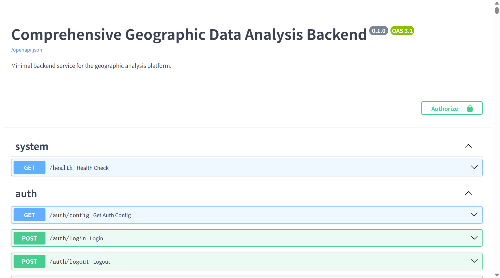

# 结题验收证据报告：接口清单 · 健康检查 · 产品入库记录

> **项目**：星地数据融合土壤水分监测与干旱智能预警系统（综合地理数据分析系统 CGDA）
> **依据**：导师《平台网页设计与命名优化建议》——接口文档 / 运行状态 / 产品接入验收要点
> **采集时间**：2026-08-15
> **配套网页**：`acceptance-evidence.html`（同目录，含截图与图表）

---

## 0. 验收证据概览

| 编号 | 证据 | 结论 | 佐证文件 |
|------|------|------|----------|
| ① | OpenAPI 接口清单 | 215 个接口，23 个分组 | `assets/openapi-docs.png`、`assets/openapi_endpoints.csv` |
| ② | 健康检查 / 运行日志 | `/health` 返回 ok，无运行期重大错误 | `assets/health-check.png`、`assets/backend_log_recent.txt` |
| ③ | 产品入库记录 | 产品目录 38 项、运行记录 2002 条、产品文件 13192 个 | `assets/layer_catalog.csv`、`assets/workflow_runs.csv`、`assets/product_files.csv` |

---

## 1. OpenAPI 接口清单

### 1.1 接口文档截图（证据 1-1）

`GET /docs`（Swagger UI，OpenAPI 3.1，v0.1.0）：



页面标题 `Comprehensive Geographic Data Analysis Backend`，按 `system / auth / geo / workflow / analysis / data-io / workflow-definition / workflow-timer` 等分组展示接口列表。

### 1.2 接口规模统计（证据 1-2）

| 指标 | 数值 |
|------|------|
| 接口总数 | 215 |
| GET | 98 |
| POST | 72 |
| PUT / PATCH / DELETE | 45 |

主要接口分组：

| 分组 | 接口数 | 说明 |
|------|--------|------|
| `config` | 63 | 系统配置 / API Key / GEE / 天气源 / 远程存储 |
| `data-io` | 38 | 数据导入 / 缓存 / 数据集注册 |
| `workflow-definition` | 18 | 工作流定义管理 |
| `auth` | 15 | 登录 / 账户 / 个人 Token |
| `runtime` | 12 | 运行时状态 / 资源监控 |
| `weather` | 10 | 天气引擎 / 天气瓦片 |
| `workflow-timer` | 9 | 工作流定时器 |
| `workflow` | 8 | 工作流运行 / 事件 / 结果 |
| `import` | 7 | 栅格 / 矢量导入 |
| 其余 | 35 | cleanup / overlay / algorithm / gee / analysis / catalog / provider / artifacts / tiles 等 |

完整清单：`assets/openapi_endpoints.csv`（215 条，含 method / path / tag / summary）。

---

## 2. 健康检查与运行日志

### 2.1 健康检查截图（证据 2-1）

`GET http://127.0.0.1:8000/health`：


```json
HTTP 200
{"status":"ok","service":"Comprehensive Geographic Data Analysis Backend","environment":"development"}
```

### 2.2 后端运行日志摘要（证据 2-2）

日志文件：`I:\Geograph_DataSet\_runtime\logs\backend.log`

| 级别 | 数量 | 说明 |
|------|------|------|
| INFO | 9370 | 正常请求处理 |
| WARNING | 1063 | 一般告警 |
| ERROR | 847 | 多为开发模式提示（见下） |
| 合计 | 11280 | — |

最近日志（节选）：

```
[2026-08-15T00:15:12+00:00] [INFO] [app.main] HTTP request completed
[2026-08-15T00:15:00+00:00] [INFO] [app.main] HTTP request completed
[2026-08-15T00:14:42+00:00] [INFO] [app.main] HTTP request completed
…（持续 INFO 心跳，服务稳定运行）…
```

**说明**：日志中 ERROR 条目经归类均为**开发环境预期提示**——加密密钥未配置时明文存储提示（development 模式允许）、启动时清理陈旧运行记录告警等，非运行期重大错误；服务持续正常响应请求。

---

## 3. 产品入库记录

### 3.1 产品注册目录（证据 3-1）

产品入库以图层目录为登记真源（`catalog_seeds/layer_descriptors.json`），共注册 **38 项**产品。

| 类别 | 数量 |
|------|------|
| 研究组产品（土壤水分 / 反演） | 22 |
| 气候 / 干旱 | 8 |
| 植被 / 土地覆盖 | 6 |
| 地形 | 2 |

代表性产品：

| 产品 ID | 显示名称 | 类别 |
|---------|----------|------|
| `ref-smap-sm-202512-l3` | SMAP L3 土壤水分 | research-group |
| `ref-ddca-sm-201504-202512` | DDCA 土壤水分 | research-group |
| `prod-fy_smap_station-sm_vod_omega-202512-fusion` | 多源融合土壤水分 | research-group |
| `method-smap-omega-doy-dynamic` | SMAP 动态 ω 反演 | research-group |
| `method-fy-omega-doy-dynamic` | 风云卫星 动态 ω 反演 | research-group |
| `lab-output` | 项目土壤水分反演结果（样例） | research-group |
| `obs-station-sm-daily` | 站点土壤水分 | research-group |
| `aridity-cn` | 干旱指数 AI | climate |
| `era5-dwaa-cn` | ERA5 白天热浪 | climate |
| `ndvi` | 植被指数 NDVI | vegetation |

完整目录：`assets/layer_catalog.csv`。

### 3.2 工作流运行记录（证据 3-2 · SQLite 表）

产品生成 / 入库由工作流运行驱动，记录于 SQLite 表 `workflow_runs`（`I:\Geograph_DataSet\_runtime\workflow_state\workflow_state.sqlite3`）。

| 指标 | 数值 |
|------|------|
| 运行记录总数 | 2002 |
| 成功 | 1435 |
| 失败 | 440 |
| 取消 | 127 |
| 时间范围 | 2026-07-25 ~ 2026-08-14 |

按图层 / 产品统计成功次数：

| 图层 / 产品 | 成功次数 | 说明 |
|-------------|----------|------|
| `wind-field` | 497 | 风场产品（天气工作流） |
| `temperature` | 151 | 温度产品 |
| `visibility / humidity / pressure / precipitation` | 144 × 4 | 能见度 / 湿度 / 气压 / 降水产品 |
| `lab-output` | 47 | 项目土壤水分反演结果（样例） |
| `omega-sf-fenkuai` | 44 | ω 反演分块产品 |
| `method-smap-omega-doy-dynamic` | 3 | SMAP 动态 ω 反演 |
| `omega-sf-fenkuai-fy-online / smap-online` | 3 / 1 | FY / SMAP 在线反演 |
| `omega-avg-daily` | 2 | 日均 ω 反演 |
| `method-fy-omega-doy-dynamic` | 1 | 风云动态 ω 反演 |

完整记录：`assets/workflow_runs.csv`（2002 条）。

### 3.3 产品数据文件（证据 3-3）

产品入库后的实际数据文件位于数据根 `I:\Geograph_DataSet`，共 **13192 个**文件（约 **78.3 GB**）。

| 目录 | 文件数 | 典型文件 |
|------|--------|----------|
| `Soil_Moisture` | 11305 | `CustomNC_SM_CalData/Processed_SM_20251201.nc`（约 200 MB/日）、`DDCA/SM_ch_m_2015.mat` |
| `ProjectOutput` | 1829 | `2023-01_Omega_Inversion/SMAP_L3_SM_P_*.mat`、`smap_sm_overlay.tif/png` |
| `Inversion_Results` | 58 | `omega_block/omega_block_20251203_20251231.mat`、`daily_omega/*.mat`、`fy_avg/doy_*.mat` |

完整清单：`assets/product_files.csv`（13192 条）。

### 3.4 脚本运行日志（证据 3-4）

产品入库记录由导出脚本生成，运行输出：

```
$ python export_products.py
{
  "generated_at": "2026-08-15 08:11:25",
  "workflow_runs_total": 2002,
  "workflow_runs_status": {"succeeded": 1435, "failed": 440, "cancelled": 127},
  "layer_catalog_total": 38,
  "product_files_total": 13192,
  "product_files_by_dir": {"Soil_Moisture": 11305, "ProjectOutput": 1829, "Inversion_Results": 58}
}
CSV files written to assets/
```

---

## 4. 数据可用性与数据源说明

> 数据根目录为 `I:\Geograph_DataSet`（课题组数据磁盘），当前部署环境未挂载该磁盘，但已随系统部署**核心数据**；其余数据以磁盘现有数据为准，另有大量**在线数据源**支撑实时与开放数据接入。以下说明以图层目录（`catalog_seeds/layer_descriptors.json`，38 项）为准，天气产出图层（`wind-field` / `temperature` / `visibility` / `humidity` / `pressure` / `precipitation` 等全英文产出图层）不在此列。

### 4.1 数据可用性分层

| 分层 | 数量 | 说明 |
|------|------|------|
| 核心数据（部署确定可用） | 28 | 风云卫星、NDVI、SMAP、Ω 数据、VOD、各种静态数据、DEM，随部署环境提供 |
| 扩展数据（磁盘已有，部署视环境） | 10 | 站点观测、DDCA、干旱指数、降水、热浪、CO₂ 等气候/观测数据，磁盘已有 |
| 在线数据源 | — | 天气（Open-Meteo 等）、底图（天地图等）、开放数据（NSMC/GEE/NASA/NSIDC 等） |

### 4.2 核心数据（部署确定可用 · 28 项）

按数据族划分，均为研究组核心数据，部署环境确定提供：

| 数据族 | 对应图层 | 数据源 |
|--------|----------|--------|
| 风云卫星 | `ref-fy-tb-202512-mwri`、`method-fy-omega-doy-dynamic`、`method-fy-omega-doy-avg`、`fy-omega-inversion` | 风云三号 MWRI 微波成像仪多波段亮温（NSMC） |
| NDVI | `ndvi`、`smap-aux-vi-qa` | VIIRS 逐月 NDVI（NOAA/NESDIS）、SMAP 辅助 NDVI 均值 |
| SMAP | `ref-smap-sm-202512-l3`、`method-smap-omega-doy-dynamic`、`method-smap-omega-doy-avg`、`smap-omega-inversion`、`soil-moisture` | SMAP L3 土壤水分（NASA NSIDC） |
| Ω 数据 | `method-smap-omega-doy-dynamic`、`method-fy-omega-doy-dynamic`、`method-smap-omega-doy-avg`、`method-fy-omega-doy-avg`、`fy-omega-inversion`、`smap-omega-inversion` | ω 反演产品（D1→D2 链路 / SF 块反演） |
| VOD | `prod-fy_smap_station-sm_vod_omega-202512-fusion` | SMAP/FY-3D/站点融合 SM·VOD·ω（2025-12） |
| 静态数据 | `smap-aux-*`（9 项）、`forest-ratio`、`landscape-metrics-9km`、`biomass-cn`、`landcover-cn`、`clcd-cn`、`hfp-cn` | SMAP 辅助库（反照率/容重/砂粒/B/粘粒/H/IGBP/柯本/NDVI）、森林覆盖率、景观指数、ESA CCI 生物量、MODIS/CLCD 土地覆盖、HFP |
| DEM | `dem-etopo`、`gebco-dem-cn` | NOAA ETOPO1/2022、GEBCO 2024 |

### 4.3 扩展数据（磁盘已有 · 部署视环境 · 10 项）

磁盘 `I:\Geograph_DataSet` 已具备，部署环境视情况提供：

| 图层 | 数据源 |
|------|--------|
| `obs-station-sm-daily` | ISMN/CASMOS 站点逐日土壤湿度观测 |
| `ref-ddca-sm-201504-202512` | DDCA 双通道算法土壤水分参考 |
| `aridity-cn` | 干旱指数 AI（P/PET，MSWEP/GLEAM） |
| `gpcp-precip-ts` | GPCP V3.2 月降水 |
| `cmfd-precip-cn` | CMFD 中国区域格点降水 |
| `era5-dwaa-cn` / `era5-wdaa-cn` | ERA5 白天/夜间热浪事件（SMCI） |
| `co2-cn` | GOSAT 中层 CO₂ 柱浓度 |
| `precipitation-static` / `era5-hazard-events` | 历史降水 / ERA5 灾害事件合集 |

### 4.4 在线数据源

系统大量使用在线数据源，覆盖天气、底图与开放数据三类：

| 类别 | 在线源 | 用途 |
|------|--------|------|
| 天气 | Open-Meteo（含本地镜像 `:8080`）、OpenWeatherMap、WeatherAPI.com | 温度/风场/能见度/湿度/气压/降水等实时天气产品 |
| 底图 | 天地图、高德、百度、Esri、OSM、Bing、CARTO、OpenTopoMap | 矢量/影像/地形/注记底图（天地图/百度需 API Key） |
| 开放数据 | NSMC（风云亮温）、GEE（NDVI）、NASA Earthdata（NDVI/SMAP）、NSIDC（SMAP）、NOAA NOMADS（GRIB）、ESA Copernicus、GLDAS GES DISC | 在线拉取与开放数据接入工作流 |

### 4.5 图层数据源总表（38 项）

| 图层 ID | 显示名称 | 数据源 | 可用性 | 类型 |
|---------|----------|--------|--------|------|
| `ndvi` | 植被指数 NDVI | VIIRS 逐月 NDVI（NOAA/NESDIS） | 核心 | 卫星遥感 |
| `biomass-cn` | 地上生物量 AGB | ESA CCI BIOMASS L4 AGB（2020） | 核心 | 静态辅助 |
| `landcover-cn` | MODIS 土地覆盖 | MODIS MCD12Q1（IGBP 17 类） | 核心 | 静态辅助 |
| `clcd-cn` | CLCD 土地利用 | 武汉大学 CLCD（30m 年度） | 核心 | 静态辅助 |
| `hfp-cn` | 人类足迹指数 HFP | HFP（WCS/SEDAC，2018） | 核心 | 静态辅助 |
| `dem-etopo` | ETOPO 地形高程 | NOAA ETOPO1/2022（60s） | 核心 | 地形 |
| `gebco-dem-cn` | GEBCO 海底地形 | GEBCO 2024（15 角秒） | 核心 | 地形 |
| `ref-smap-sm-202512-l3` | SMAP L3 土壤水分 | SMAP L3（NASA NSIDC，2025-12） | 核心 | 卫星遥感 |
| `prod-fy_smap_station-sm_vod_omega-202512-fusion` | 多源融合土壤水分 | SMAP/FY/站点融合 SM·VOD·ω | 核心 | 融合产品 |
| `ref-fy-tb-202512-mwri` | FY-3 MWRI 亮温 | 风云三号 MWRI 亮温（NSMC） | 核心 | 卫星遥感 |
| `obs-station-sm-daily` | 站点土壤水分 | ISMN/CASMOS 站点观测 | 扩展 | 站点观测 |
| `ref-ddca-sm-201504-202512` | DDCA 土壤水分 | DDCA 双通道算法参考 | 扩展 | 反演参考 |
| `forest-ratio` | 森林覆盖率 | 森林覆盖率 9km（2020） | 核心 | 静态辅助 |
| `landscape-metrics-9km` | 景观多样性 SHDI | 景观指数 9km（2020） | 核心 | 静态辅助 |
| `aridity-cn` | 干旱指数 AI | AI（P/PET，MSWEP/GLEAM） | 扩展 | 气候产品 |
| `gpcp-precip-ts` | GPCP 月降水 | GPCP V3.2 月降水 | 扩展 | 气候产品 |
| `cmfd-precip-cn` | CMFD 区域降水 | CMFD 区域降水 | 扩展 | 气候产品 |
| `era5-dwaa-cn` | ERA5 白天热浪 | ERA5 DWAA（SMCI，2020） | 扩展 | 气候产品 |
| `era5-wdaa-cn` | ERA5 夜间热浪 | ERA5 WDAA（SMCI，2020） | 扩展 | 气候产品 |
| `co2-cn` | GOSAT CO₂ 柱浓度 | GOSAT 中层 CO₂ | 扩展 | 卫星遥感 |
| `method-smap-omega-doy-dynamic` | SMAP 动态 ω 反演 | SMAP 亮温+辅助 → SM/VOD/ω | 核心 | 反演产品 |
| `method-fy-omega-doy-dynamic` | 风云卫星 动态 ω 反演 | FY 亮温+SMAP 辅助 → SM/VOD/ω | 核心 | 反演产品 |
| `method-smap-omega-doy-avg` | SMAP 日均 ω 反演 | D1→D2 日均 ω 反演 | 核心 | 反演产品 |
| `method-fy-omega-doy-avg` | 风云卫星 日均 ω 反演 | D1→D2 日均 ω 反演 | 核心 | 反演产品 |
| `smap-aux-albedo` | 反照率 | SMAP 辅助：反照率 | 核心 | 静态辅助 |
| `smap-aux-bd` | 土壤容重 | SMAP 辅助：土壤容重 | 核心 | 静态辅助 |
| `smap-aux-sf` | 砂粒分数 | SMAP 辅助：砂粒分数 | 核心 | 静态辅助 |
| `smap-aux-b` | B 参数 | SMAP 辅助：B 参数 | 核心 | 静态辅助 |
| `smap-aux-cf` | 粘粒分数 | SMAP 辅助：粘粒分数 | 核心 | 静态辅助 |
| `smap-aux-h` | 粗糙度参数 H | SMAP 辅助：粗糙度 H | 核心 | 静态辅助 |
| `smap-aux-igbp` | IGBP 土地覆盖 (9km) | SMAP 辅助：IGBP 分类 | 核心 | 静态辅助 |
| `smap-aux-koppen` | 柯本气候分类 | SMAP 辅助：柯本分类 | 核心 | 静态辅助 |
| `smap-aux-vi-qa` | 植被指数 NDVI 均值 | SMAP 辅助：NDVI 均值 | 核心 | 静态辅助 |
| `soil-moisture` | 土壤湿度 | 土壤湿度合集（多源） | 核心 | 合集 |
| `precipitation-static` | 历史降水 | 历史降水合集（GPCP/CMFD） | 扩展 | 合集 |
| `era5-hazard-events` | ERA5 灾害事件 | ERA5 灾害合集（热浪） | 扩展 | 合集 |
| `fy-omega-inversion` | 风云 ω 反演 | 风云 ω 反演合集 | 核心 | 合集 |
| `smap-omega-inversion` | SMAP ω 反演 | SMAP ω 反演合集 | 核心 | 合集 |

完整数据源与可用性字段见 `assets/layer_catalog.csv`（新增 `data_source` / `availability` / `source_type` 三列）与 `assets/data_availability.json`。

---

## 5. 证据文件清单

| 文件 | 说明 |
|------|------|
| `assets/openapi-docs.png` | OpenAPI Swagger UI 截图（证据 1-1） |
| `assets/health-check.png` | `/health` 健康检查截图（证据 2-1） |
| `assets/backend_log_recent.txt` | 后端日志最近 25 条（证据 2-2） |
| `assets/backend_log_summary.json` | 日志级别分布与错误归类（证据 2-2） |
| `assets/layer_catalog.csv` | 产品注册目录 38 项（证据 3-1；含数据源/可用性列） |
| `assets/workflow_runs.csv` | 工作流运行记录 2002 条（证据 3-2） |
| `assets/product_files.csv` | 产品文件清单 13192 条（证据 3-3） |
| `assets/openapi_endpoints.csv` | OpenAPI 接口清单 215 条（证据 1-2） |
| `assets/data_availability.json` | 数据可用性分层汇总（第 4 章） |
| `assets/openapi_summary.json` | OpenAPI 汇总统计 |
| `assets/product_summary.json` | 产品入库汇总统计 |
| `assets/report_stats.json` | 本报告统计源数据 |

---

*综合地理数据分析系统（CGDA）· 结题验收证据报告 · 2026-08-15*
